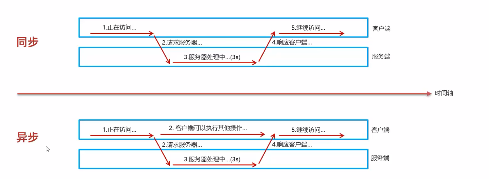

# Ajax

## 请求的类型

在Web网页中，发送的请求方式有：

- 输入URL跳转页面
- 页面内资源URL

```html
<script src="./script.js"></script>
<link rel="stylesheet" type="text/css" href="./style.css">
 
```

- a链接，从当前页面跳转至href页面，不会新建窗口

```html
<a href="https://www.baidu.com">点击跳转</a>
```

- form提交，页面将发生跳转

- 使用JS代码添加事件

## Ajax概念

*Asynchronous JavaScript And XML*。异步的JS和XML

Ajax能够做到：

- 不刷新页面更新网页
- 在页面加载后从服务器请求与接收数据（异步交互）

## 异步与同步

异步交互：可以在不重新加载整个页面的情况下，与服务器交换数据并更新网页的技术



异步交互的实现就是使用JavaScript代码。例如我们希望输入姓名向后台发送请求验证是否存在，并得到服务端的response渲染到相应的DOM树中

form表单的默认行为则无法做到异步交互，他只能实现同步交互，因此我们常需要阻止form的默认事件

# xmlHttpRequest

xmlHttpRequest对象又称XHR。

在JS的学习中，我们曾使用JS实现姓名的校验，实际上我们把数据写入了JS代码中，因此没有向服务端请求，相当于本地版的Ajax。但是实际的环境我们都需要向服务器发送请求并获得数据。我们可以使用XHR对象向服务器发送request请求，服务器响应response。

使用JS代码使用xmlHttpRequest对象发送请求实现异步交互也称原生Ajax。

原生Ajax操作繁琐，已很少使用，现在主要使用的是Vue中对异步交互进行封装的Axios

