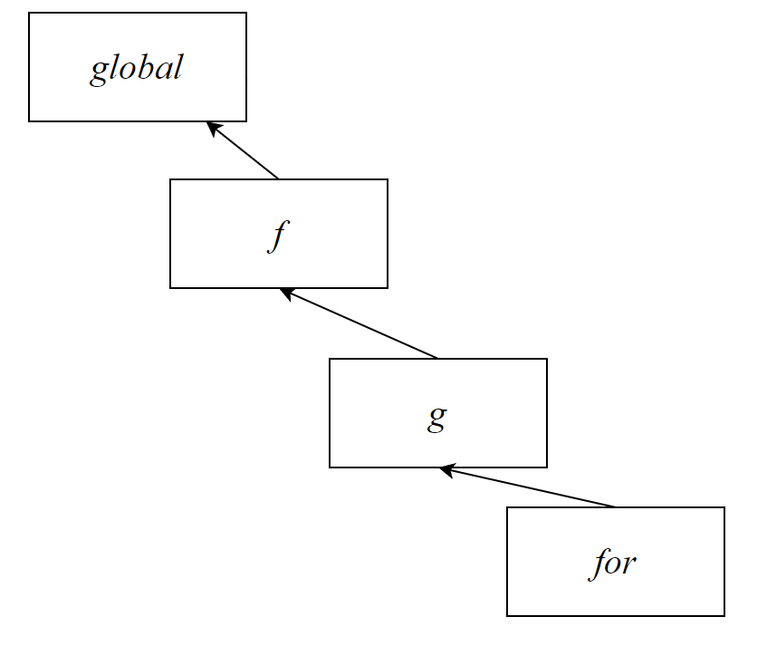
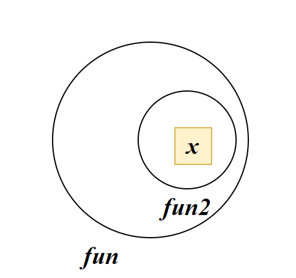

# 作用域

## 作用域链


作用域链本质上是底层的变量查找机制。

在函数被执行时，会优先查找当前函数作用域中查找变量

如果当前作用域查找不到则会**依次逐级查找父级作用域**直到全局作用域



子作用域能够访问父作用域，父级作用域无法访问子级作用域

## JS垃圾回收机制(GC)


### 引用计数算法


### 标记清除法


## 闭包

闭包*Closure*：在内层函数中使用到了外层函数的变量。

我们可以在函数中嵌套声明一个函数

```js
function fun1(){
    let x=1
    function fun2(){
        console.log(x)
    }
    fun2()
}
fun1()
```

**内部函数+内部函数使用外部变量便可以生成闭包**

### 闭包的应用

闭包的作用在于外部可以访问到内部的变量



当我们在fun中return fun2时，外部就可以访问变量x了

```js
function User() {
    let _age=0//私有化变量，不允许外部直接调用
    this.getAge=function () {
        return _age
    }
    this.setAge=function (age) {
        if(age>0) _age=age
    }
}
const user=new User()
user.setAge(12)
console.log(user.getAge());
```

闭包就是解决我们访问函数内部变量我问题。

### 闭包带来的问题


## 变量提升

会将var声明的变量提升到当前作用域的最前面。只提升声明，不提升变量赋值

```js
console.log(num)
var num=10
```

实际运行的代码：

```js
var num
console.log(num)//undefined
num=10
```


`let`喝`const`不存在变量提升

实际开发中不建议使用`var`

##  函数提升

函数调用可以声明在函数声明之前

```js
fun()
function fun(){
    
}
```

会把所有函数声明提升到当前作用域最前面。只提升函数声明，不提升函数调用

# 函数参数

## 动态参数

引入：根据传入的实参，计算实参和

不确定传入的实参的个数可以使用动态参数或剩余参数

```js
sum(2,4)
sum(5,10,10)
sum(11,23,45,14)
```

动态参数`arguments`是函数内部内置的**伪数组**（变量），arguments数组中存储了函数传来的实参

```js
sum(12,13,14)
function sum(){
    console.log(arguments)//11,12,14
}
```

## 剩余参数

剩余参数与动态参数类似。声明一个剩余参数：

```js
function (实参列,...剩余参数名){
    
}
```

```js
sum(1,2,3)
function (a,...arr)

```

> a=1,arr=[2,3]


剩余参数是一个真数组。开发中建议使用剩余参数

**剩余参数本质上是展开运算符**

```js
...arr=1,2,3
arr=[1,3,3]
```


## 展开运算符

```js
... 引用shu'ju
```

```js
const arr=[1,2,3]
console.log(...arr)
//1,2,3
```

展开运算符不会修改原数组。

展开运算符的应用：

- 作为函数的实参

```js
Math.max(...arr)
//等价于
Math.max(1,2,3)
```

- 合并数组

```js
const arr2=[3,4,5]
const arr3=[...arr2,...arr]
//[3,4,5,1,2,3]
```


# 箭头函数

## 可变参数

箭头函数中不存在arguments动态参数，可以使用剩余参数

```js
(...arr)=>{
    for(let i=0;i<arr.length;i++)
}
```

## this

### 普通函数的this

在全局作用域中，this=window

```js
this
//window
```

this指向的是函数的调用者

```js
function fun(){
    console.log(this)
}
fun()
//this=Window
```

```js
obj={
    say(){
        console.log(this)
    }
}
obj.say()
//this=obj
```

传统的函数声明中的this是根据调用者来定义的，非常麻烦

而箭头函数不会创建自己的this，他只会从自己的作用域链的上一层沿用this

```js
()=>{
    console.log(this)//window
}
```

```js
obj={
    say:()=>{
        console.log(this)
    }
}
obj.say()
//this=window
```


### 箭头函数的this

# 解构

## 数组解构

数组解构是将数组的单元值快速批量赋值给一系列变量的简洁语法

### 基本语法


基本语法：

将数组中的元素依次赋值给变量列

```js
const/let [变量1,变量2,...,变量n]=数组
```

等价于

```js
const 变量1=数组[0]
const 变量2=数组[1]
...
const 变量n=数组[n-1]
```

如果变量已经声明，则可以省略`const`/`let`

```js
const arr=[1,2,3]
const [a,b,c]=arr
//a=1,b=2,c=3
```


### 解构配合使用

- 解构数目不匹配

```js
const [a,b,c,d]=[1,2,3]
//d=undefined
```

- 配合展开运算符：

```js
const[a,b,...arr]=[1,2,3,4]
//arr=[3,4]
```

- 配合函数默认值：

```js
const[a=0,b=0]=[1,2]
```

- 忽略某些匹配项：

```js
const[a,b,,d]=[1,2,3,4]
//a=1,b=2,d=4
```


## 对象解构

### 基本语法

```js
const/let {key1,key2,...keyn}=对象
```

对象解构要求声明的变量和对象中对应的key相同。JS会将对象中的value赋值给相同key名称的变量

```js
const obj={
    uname:'Pink',
    age:12
}
//传统语法：
obj.uname
obj.age
```

```js
const{uname,age}={uname:'Pink',age:12}
console.log(uname)//Pink
console.log(age)//12
```

### 声明不一致的key

```js
const/let {变量:key}=对象
```

`:`表示将key的值赋值给变量

```js
const{name:uname,age}={uname:'Pink',age:12}
```

### 多级对象解构


## 对象数组解构

嵌套使用数组与对象的解构语法即可解构对象数组

```js
const [{name1:uname,age1:age},{name2:uname,age2:age}]=pigs
```

## 函数中的解构

函数的形参列也可以使用解构语法

```js
function fun({mydata:data}){}
fun(msg)
```

将msg对象中的key为data的value赋值给mydata