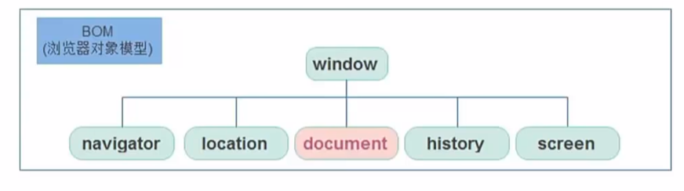
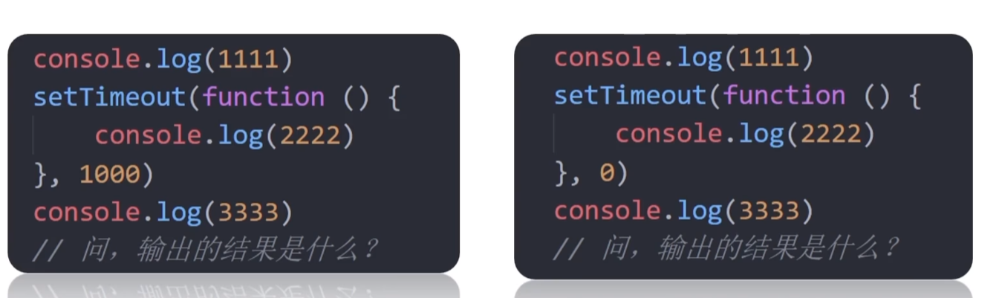
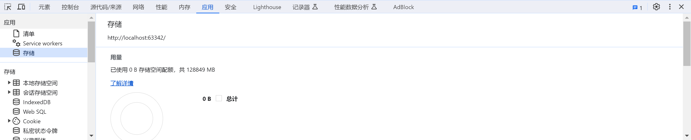

# BOM

BOM，*Browser Object Model*，浏览器对象



## window

window对象是一个全局对象，document是window的属性。window常常忽略

```js
document.querySelector()
```

完整的代码为：

```js
window.document.querySelector()
```

JS中声明的全局变量例如全局函数，`var`都将归入BOM中（window）

```js
function fun(){}
window.fun()
```

## 定时器：延时函数

此类定时器将只执行一次，使用`setTimeout`函数声明该定时器

```js
setTimeout(回调函数,毫秒数)
```

在time时间后将执行回调函数一次

- `clearTimeout`清除延时函数

## JS执行机制



JS是单线程的，所有的任务需要排队，前一个任务结束，才会执行后一个任务，这样将会产生一个问题：

如果某段JS执行的时间过长，这样会造成页面的渲染，导致阻塞。例如等待定时器完成再执行下面的代码

为了解决该问题，允许JS创建多个线程

### 同步

### 异步


---

### 执行机制

1. 先执行执行栈中的同步任务
2. 异步任务放入任务队列
3. 一旦执行栈中的所有同步任务执行完毕，系统将会按照次序读取任务队列中的异步任务，被读取的异步任务将进入执行栈开始执行

# location对象

location对象拆分并保存了URL地址的各个组成部分

- `href`

  完整URL

  > example:
  >
  > 对`href`进行赋值，可以实现页面的跳转
  >
  > ```js
  > location.href='www.baidu.com'
  > ```
  >
  > 

- search

  获取地址中的GET参数

  http://localhost:63342/JavaScript/code/test/form.html?username=lai

  ```js
  location.search
  //username=lai
  ```

- `hash`

  获取URL后的`#参数`

  `<a href='#/music'>MUSIC <a>`

  ```js
  location.hash
  // RES： #/music
  ```

- `reload()`

  刷新(*F5*)当前的页面，传入`true`表示强制刷新

  ```js
  location.reload(true)
  ```

  

# navigator对象

获取当前浏览器自身的信息

- `userAgent`

  浏览器的版本以及平台

常用于Web客户端的识别，并跳转至相应的网页版本：移动端/PC端

`!function(){}()`等价于`(function(){}())`立即执行函数

# history对象

主要应用于浏览器中的前进与后退

- `back()`后退1个页面

- `forward()`前进1个页面

- `go(参数)`

  参数为1，表示前进1个页面，-1表示后退1个页面

  ```js
  history.go(1)
  ```

# 本地存储

为了让页面刷新之后，数据不会丢失，我们可以对数据进行持久化操作

前端可以将数据存储在用户浏览器中

数据仓库的容量最大为5M



本地存储空间根据不同的域名存储数据，每一个域名就像是一个数据库

## localStorage

`localStorage`是`key：value`类型的数据库。生命周期为永久

- 添加数据

```js
localStorage.setItem(key,value)
```

```js
localStorage.setItem(username,'lai')
```

- `getItem()`

  获取`value`

```js
localStorage.getItem(key)
```

- `removeItem`

  根据key删除数据

```js
localStorage.removeItem(key)
```

- 修改数据

```js
localStorage.setItem(key,value)
```

## sessionStorage

`sessionStorage`是key：value类型的数据库。他的生命周期为关闭浏览器窗口

在同一个页面下数据可以共享

方法与`localStorage`相同

```js
sessionStorage.setItem(key,value)
sessionStorage.getItem(key)
sessionStorage.removeItem(key)
```

## JSON

存储复杂数据类型我们可以将其封装成对象

```js
localStorage.setItem('obj',对象)
```

但是存储对象并不能很清晰得到该对象的具体数据。

为此我们需要将JS对象转为*JSON字符串*

- 对象转为JSON字符串

```js
JSON.stringify(对象)
```

```js
        const obj = {
            name: 'lai',
            age: 12,
            address: 'XMN'
        }
        localStorage.setItem('obj',JSON.stringify(obj) )
```

> JSON字符串：
>
> {"name":"lai","age":12,"address":"XMN"}

- JSON转为JS对象

```js
JSON.parse(JSON字符串)
```

## map和join

`map`：映射新的数组

map的返回值为一个新数组，会将每次return的新元素添加至该数组中

```js
新数组=数组.map(function(元素,索引){
    //元素处理
    return 处理后的元素
})
```

```js
const arr=['red','blue','green']
const new=arr.map(function(ele,index){
    return ele+'颜色'
})
//['red颜色','blue颜色','green颜色']
```

join方法：将数组中是所有元素拼接成一个字符串，分隔符默认为`,`

```js
数组.join('分隔符')
```

```js
const arr=['red','blue','green']
arr.join('和')
//red和blue和green
```

