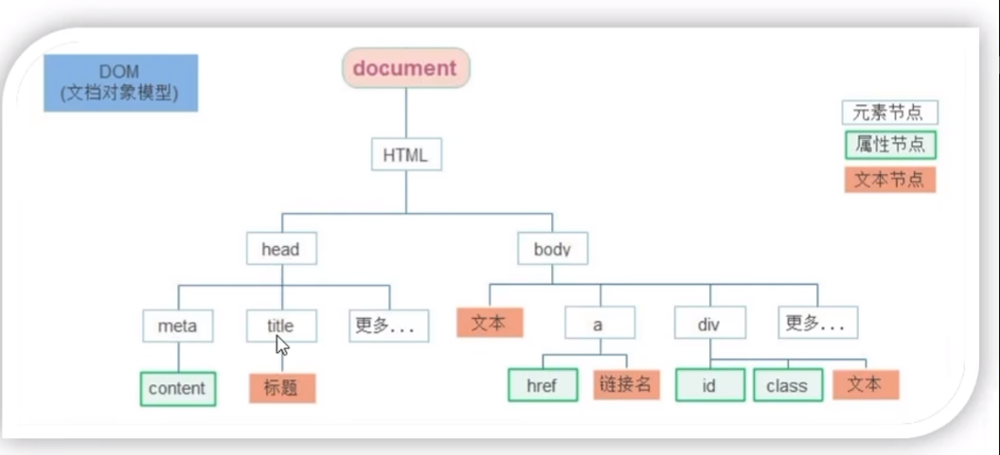

#  DOM

文档对象模型 Document Object Model，DOM用于操作HTML标签。使用DOM开发网页可以实现网页内容与用户交互


## DOM树

将HTML文档以树状结构直观的表现出来，称之为DOM树

DOM树直观地体现了标签与标签之间的关系



## DOM对象

浏览器根据HTML标签自动创建的JS对象（DOM对象）。

- JS对象中存在标签的所有属性
- 修改这个对象的属性也会映射到标签身上

```html
<div >
    
</div>
```

```js
const div=document.querySelector('div')
typeof div //object
```

### document对象

document对象是HTML中最大的DOM对象，他提供了操作网页的属性和方法。

网页中的所有内容都在document中

```js
document.write(`this is dom`)
```

## 获取DOM对象

JS可以使用CSS选择器获取DOM对象

### querySelector

```js
document.querySelector('CSS选择器')
```

```js
document.querySelector('div')
document.querySelector('.box')
```

querySelector只能返回一个DOM对象，如果选择器可以匹配多个标签，他将选择第一个匹配的标签。

如果没有匹配的标签将返回`null`

### querySelectorAll

querySelectorAll可以返回所有匹配的标签

```js
        const objectArr=document.querySelectorAll('div')
        console.dir(objectArr)//NodeList(3)
```

querySelectorAll返回的数据类型是**伪数组**。伪数组有`length`属性，但是无法使用数组的方法，因为其本质上是`object`类型

```js
typeof objectArr//object
```

伪数组对象结构如下：属性名（`key`）为索引，`value`为DOM对象，DOM对象名称可以重复

```js
NodeList(3)={
0: div.type1
1:  div.type2
2:div
length: 3
[[Prototype]]: NodeList
}
```

### 旧语法

旧语法存在获取DOM对象的一些方法

```js
document.getElementById()
document.getElementsByTagName()
document.getElementsByClassName()
```

# DOM对象属性

## Text

- `innerText` HTML标签内部文本

  忽略所有的html标签，并得到所有的纯文本信息

  ```html
      <div class="type1">
          hello
          <div>内部</div>
      </div>
  ```

  ```js
  const document.querySelector('div')
  console.log(div.innerText)
  //hello 
  //内部
  div.innerText='hello world'//修改HTML内部内容
  ```

  

- `innerHTML`

  能够识别HTML标签，并得到所有的带HTML标签的文本信息

  ```js
  console.log(div.innerHTML)
   //       hello
   //      <div>内部</div>
  ```

  

## image

- `href`

- `title`

- `src` 图片位置

  ```js
  const pic =document.querySelector('img')
  pic.src='./imges/b02.jog'
  pic.title='hello world'
  ```


## style

```js
DOM对象.style.样式属性
```

```js
box.style.width='200px'
```

对于带有`-`的样式属性，需要转为小驼峰命名。因为`-`会被JS解析成减号

例如：`background-color` -> `backgroundColor`

## body

body在HTML中是唯一的，因此可以直接获取

```js
document.body
```

## className

如果修改的样式比较多，直接通过style属性修改比较繁琐，我们可以通过借助CSS类名的形式

`className`对应于HTML标签的`class`属性，修改`className`会直接覆盖`class`的value

```js
对象.className='active'//class=active
```

```css
.active{
    width:300px;
    height:100px;
    color:red; 
}
```

使用JS使某个标签可以动态加载不同的CSS样式

## classList

为了解决className容易覆盖以前的class，我们可以通过`classList`方式追加和删除类名

```js
对象.classList.add('类名')//追加类
对象.classList.remove('类名')//删除类
对象.classList.toggle('类名')//切换类
```

`toggle`的作用是如果HTML标签中如果存在该类名就删除，如果不存在该类名则追加

```js
//class='box active'
dom.classList.toggle('box')//class ='active'
```

## Form

### value

```html
<input type="text" >
```

```js
const username =document.querySelector('input').value
```

### checked

checkbox存在属性`checked`表示该复选框是否被勾选，true为勾选状态，false为未勾选状态

```js
document.querySelector('input').checked=true
```

### disabled

button的属性disabled属性控制按钮是否禁用

- disabled=false 按钮不禁用（默认）
- disabled=true 按钮禁用

## button

对于按钮，其是一个双标签，获取button标签的文字通过`innerHTML`获取

```html
 <button class="btn" disabled>我已经阅读用户协议(60)</button>
```

```js
document.querySelector('btn').innerHTML//我已经阅读用户协议(60)
```


## 自定义属性

除了可以使用HTML标签定义的属性，我们也可以为HTML标签自定义属性

自定义属性规则：

- 自定义属性格式为`data-属性名`，实际属性名不含`data-`
- 自定义属性被封装在DOM对象的`dataset`属性中，使用属性名获取

```html
<!--定义了一个user属性-->
<div class='box' data-user='2024'>
    </div>
```

```js
document.querySelector('.box').dataset.user//2024
```

# 定时器

定时器用于网页中定时执行一段JS程序，而不需要我们手动触发，例如网页倒计时

## 间歇函数

定时器本质上是系统内置的函数

- 开启定时器：

```js
setInterval(function ,time)
```

每隔`time`时间将自动执行`function`这个函数

- `time` 单位为*ms*

- `function`可以是函数名或匿名函数

```js
setInterval(function(){
    console.log('hello world')
},1000)
```

间歇函数第一次执行是time毫秒之后

setInterval有返回值，返回值是一个定时器唯一的id数字

- 关闭定时器：

  使用`clearInterval`函数并传入定时器id可以关闭该定时器

  ```js
  clearInterval(定时器id)
  ```

  ```js
  let timerId=setInterval(function,time)
  clearInterval(timerId)
  ```


# 事件

用户在网页点击一个按钮就是事件

## 事件监听

我们可以为DOM对象添加事件监听，一旦触发将调用相应的函数进行响应。添加事件监听也称为绑定事件或注册事件

例如鼠标经过显示下拉菜单，点击弹出内容。

### 事件监听三要素

- 事件源：DOM对象
- 事件类型：用什么方式触发事件
- 事件调用函数：事件的具体内容

```js
DOM对象.addEventListener('事件类型',事件调用函数)
```

```js
button.addEventListenter('click',function(){
    alert('点击了')
})
```

## 事件类型

### 鼠标事件

- `click`鼠标点击
- `mouseenter`鼠标经过【没有冒泡】
- `mouseleave`鼠标离开【没有冒泡】

```js
    document.querySelector('div').addEventListener('mouseenter', function () {
        console.log('进入')
    })
    document.querySelector(('div')).addEventListener('mouseleave',function () {
        console.log('鼠标离开')
    })
```

### 焦点事件

焦点指的是输入框中的光标

- `focus`获得焦点
- `blur`失去焦点

```js
document.querySelector('input').addEventListener('focus',function(){
    console.log(获得焦点)
})
```

###  键盘事件

- `keydown`按下按键
- `keyup`弹起按键

建议使用`keyup`，因为存在用户按住不松手的情况

### 文本事件

适用于表单元素

- `input`用户输入内容

```js
//获取用户输入的内容
input.addEventListener('input',function(){
    console.log(input.value)
})
```


## 事件调用函数

当我们为某个DOM对象添加了某个类型的对象后

```js
button.addEventListenter('click',function(){
    alert('点击了')
})
```

此时该DOM对象中就成功添加了一个事件调用函数。该代码相当于

```js
click=function(){
    alert('点击了')
}
```

我们可以使用事件类型去调用该事件

```js
button.click()
```

## 事件对象

事件对象存储了事件触发时的相关信息

例如鼠标点击事件（`click`）中，事件对象中存储了鼠标点在哪个位置等信息

用户输入（`input`）时，事件对象中存储了按下了哪些按键

- 创建事件对象：函数的第一个参数就是事件对象

```js
DOM对象.addEventListener('事件类型',function(事件对象){
    
})
```

事件对象常使用*e*，*event*命名

```js
  text.addEventListener('input',function (e) {
	console.log(e)
  })
```

## 事件对象属性

以下为事件对象中的常用成员

- `type` 当前事件的类型
- `clientX`/`clientY`光标相对于浏览器窗口左上的位置
- `offsetX`/`offsetY`光标相对于当前DOM元素左上角的位置
- `key`用户按下的键盘的value

# 环境对象

环境对象指的是函数内部特殊的变量`this`，他代表当前函数运行时所处的环境

每个函数中都存在this，`this`指向了函数的调用者

```js
function fun(){
    console.log(this)//window{...}，window对象
}
fun()
```

```js
  text.addEventListener('input',function (e) {
	console.log(this) //<textarea id="tx" placeholder="发一条友善的评论" rows="2" maxlength="200"></textarea>，DOM对象
  })
```

- 在事件触发的函数中，`this`指向了事件源
- 普通函数则指向了`window`
- 箭头函数没有this

> **应用场景**：
>
> this代表了本DOM对象，就不再需要使用querySelector获取了
>
> ```js
>   document.querySelector('#tx').addEventListener('input',function (e) {
>     let num=this.value.length
>     total.innerHTML=`${num}/200字`
>   })
> ```
>
> 


# 回调函数

回调函数的字面意思为，等待时机成熟，**返回调用的函数**

如果将函数A作为参数传递给函数B，则称函数A这个函数**参数**称为回调函数

例如在定时器中`fun`就是一个回调函数

```js
function fun(){
    console.log('hello')
}
setInterval(fun,1000)
```

事件监听中，事件调用函数也是回调函数
