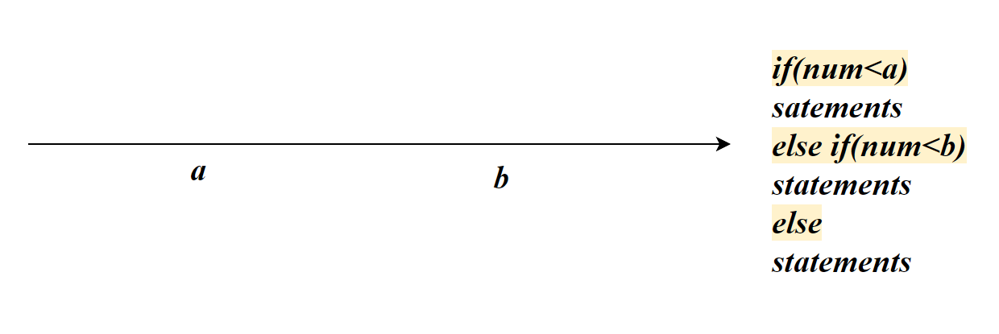
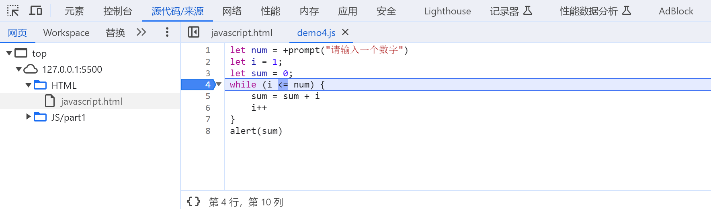
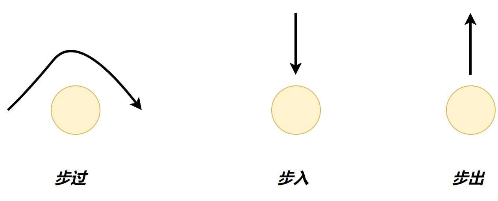

# 使用JS

## 引入外部文件

```html
    <script type="text/javascript" src="../JS/demo1.js">
    </script>
```

## 内部使用

```js
 <script >
     alert("hello world")
    </script>
```


# 基础语法

## script

script标签具有如下属性

- type 脚本中属于什么文本，默认值为text/javascript

Javascript可以被嵌入到网页中的任何位置。

```html
<!-- JS实现简单的动态网页xiao'g -->    
<div class="box">
        <script>
            for (let i = 0; i < 10; i++) {
                document.write(`
                <li>this is ${i}</li>
                `)
            }
        </script>
```

但是根据W3C标准，script标签应该放在`<body>`或`<head>`标签内，且放置在最后。

JavaScript注释和Java相同。

分号作为每条语句的结尾

对象：`{ }`

数组：`[ ]`

## 输出

- 浏览器警告信息

```js
window.alert("This is a msg")
```
- 输出信息到浏览器控制台终端

```js
console.log("This is a msg")
```
- 写入信息至指定HTML元素内部

```js
<p id="demo">Here</p>
//将在demo元素中输出7
<script>
document.getElementById("demo").innerHTML = 6+1;
</script>
```

> 7
- 直接在HTML中页面中输出信息
```js
<script>
document.write("hello world");
</script>
```

## 输入

```js
    <script>
        let name=prompt("请输入姓名")
        document.write(name)
    </script>
```


# 变量

## 声明变量

变量遵守小驼峰：userName

### 声明单个变量

```js
let  name="zhangsan"
```

声明变量之后，在没有初始化之前，它的初始值为`undefined`

同Java一样JavaScript 中不能使用连字符。它是为减法预留的。

JavaScript 使用 *Unicode* 字符集。

### 声明多个变量

```js
let  person = "Bill Gates", carName = "porsche", price = 15000;
```

## var与let

var和let都可以声明变量，但是var存在各种缺陷：

- 可以先使用，在声明

  ```js
  carName='byd'
  console.log(carName)
  var carName
  ```

- 没有块级作用域

- var可以重复声明变量

  ```js
  var name='byd'
  var name='tesla'
  ```

  > 因此声明变量建议都使用let，他是为代替var而生的

## 作用域（Scope）

### 全局作用域（Script）

*全局*（在函数之外）声明的变量拥有*全局作用域*。

一个JS文件，一个script标签内都属于一个全局作用域。

```js
var carName = "byd";

// 此处的代码可以使用 byd

function myFunction() {
  // 此处的代码也可以使用 byd
}
```

### 函数作用域（Local）

在函数内声明的变量只在函数内有效

```js
// 此处的代码不可以使用 carName

function myFunction() {
  var carName = "byd";
  // code here CAN use carName
}

// 此处的代码不可以使用 carName
```

### 块作用域（Block）

function后的作用域为函数作用域，除此之外带有`{ }`的都属于块作用域：if(){}、for(){}、对象{} 

通过 `var` 关键词声明的变量没有块作用域。在块 `{ }` 内使用`var`声明的变量可以从块之外进行访问【没有块作用域】。

```js
var i = 7;
for (var i = 0; i < 10; i++) {
  // statement
}
// 此处，i 为 10
```

要使用**块作用域**，需要使用`let`声明。`let`声明的变量在块外无法使用。因此推荐所有变量都使用`let`声明。

```js
let i = 7;
for (let i = 0; i < 10; i++) {
  // statement
}
// 此处 i 为 7
```

### 就近原则

当一个变量同时存在多个作用域时，变量根据就近原则使用。

```js
let num=10
{
    let num =11
    alert(num)//11
}
```


## const

通过 `const` 定义的变量与 `let` 变量类似，但不能重新赋值。 `const` 变量必须在声明时赋值

```js
const PI = 3.14159265359;
```

可以更改常量对象的属性，因为对象和数组是引用数据类型

```js
const car = {type:"porsche", model:"911", color:"Black"};

// 您可以更改属性：
car.color = "White";
```

无法重新为常量对象赋值，数组类似

```js
const car = {type:"porsche", model:"911", color:"Black"};
car = {type:"Volvo", model:"XC60", color:"White"};    // ERROR
```
---
> **Rules**:
>
> 在JS中，变量优先使用`const`，如果发现它后面是要被修改的，再改为`let`

# 数据类型

## 数组

```js
let arr =[1,2,3]
```

[1,2,3]为数组字面量

```js
console.log(arr[1])
```


## Number

```js
let num1 =100;
let num2=12.3;
```

### NaN

NaN是number类型的值

```JS
typeof NaN//'number'
```

当算术运算得到的结果不是一个数字时，其结果为NaN

```js
undefined+undefined//NaN
```


## String

使用单引号或双引号或反引号，推荐使用单引号

支持使用`+`进行字符串拼接

```js
let str='hello'
```

```js
let str2=`hello world`
```

```js
//不使用相同的字符串符号造成误解即可
let name ='我是"dddd"对吧'
```

### 模板字符串

模板字符串使用反引号，使用`${变量}`占位。模板字符串简化了字符串的拼接

```js
document.write(`大家好，我叫${name}，今年${age}岁`)
```

模板字符串中可以进行换行输入，

```js
document.write(`
<p>
    this is html
    </p>
`)
```

## boolean

true/false

undefined、null、NaN可以理解为false，但并不相等

NaN与任何值都不相等，包括其本身

```js
null==false//false
undefined==false//false
undefined==null//true
```

## undefined

变量只声明不赋值时，变量的默认值为**undefined**

undefined的应用在于检查变量是否为undefined，进而判断用户是否有数据传递过来 


## object

undefined表示没有赋值。null表示赋值了，但是内容为空

```js
let name =null
```

应用场景：把null作为尚未创建的对象的初始化值，如果不使用null初始化，则变量变为undefined了

## typeof

typeof关键字可以得到某个变量的类型，输出为字符串

```js
typeof '100px'
//输出结果：'string'
```

## 类型转换

**表单**中的值默认都是String，需要使用类型转换进行数据处理

### 隐式转换

`+`两边只要一边是字符串，会把另外一个也转成字符串（拼接）

其他算术运算符，会把数据转成Number（算术运算）

```js
'10'+12//1012
10-'10'//0
```

在字符串前加上`+`可以转为数字`+10`

```js
+'10'+10//20
```

### 显式转换

- `Number(value)`

  ```js
  let num='10'
  Number(num)
  ```

- `parseInt(value)`

  转value为整数

  ```js
  parseInt("10.12")//10
  ```

- `parseFloat（value）`

  转为浮点

  ```js
  parseFloat('10.12')//10.12
  ```

  > **compare**
  >
  > ```js
  > parseFloat('100px')//100
  > Number('10.12abc')//NaN
  > parseInt('12px')//12
  > ```
  >
  > Number对于value只能是数字型字符串
  >
  > parse可以识别数字开头的字符串，其最大的应用场景就是去除单位：100px

- `String(value)`

  ```js
  String(age)
  ```

- `toString`

  ```js
  age.toString()
  ```

  

# 运算符

JavaScript运算符与Java基本相同。在此将列出不同点

## 比较运算符

比较运算符除了`===`都会发生隐式转换，将**string**->**number**

### ==

`==`只要值一样就是true，而不管数据类型

```js
console.log(5=='5')//true
```

其否定式为`!=`

### ===

绝对等于，与Java中的`==`的作用相同。绝对等于要求类型和值一样才算相等，因为其不会进行隐式转换

```js
console.log(5===5)//true
console.log(5==='5')//false
```

其否定式为`!==`

### 字符串比较

比较字符对应的ascii码值。从左至右依次比较，如果第一位相同，则比较第二位，以此类推

```js
console.log('abc'>'ebc')//true
console.log('abc'>'ab')//true
```

### NaN

NaN不等于任何值，包括其本身

```js
console.log(NaN===1)//false
console.log(NaN===NaN)//false
```

### 小数比较

小数比较存在精度问题，即0.1+0.2不等于0.3

```js
console.log(0.1+0.2)
//0.30000000000000004
```

## 逻辑运算符

undefined、NaN、null、`0`可以理解为false，均会发生短路

不管是||还是&&，逻辑表达式的运算结果都是**最后被执行的表达式的值**

```js
undefined&&true//undefined
null&&true//null
NaN&&true//NaN
false&&true//false
11 || 12//1·1
11&&0//0
```

在Java中需要两个操作数均为布尔类型

```java
1>2 && 3>3//false
```

逻辑表达式的应用场景：

```js
        function fun(x,y){
            x=x||0
            y=y||0
            x+y
        }
//当前端传入undefined数据时，设置其默认值为0
```


# 逻辑


## 分支

### if

- 单分支

  ```js
  if (condition)
  	statements
  ```

- 双分支

  ```js
  if (condition)
  	statements
  else
           statements
  ```

- 多分支：适用于区间判断

  

  如果condition1成立，则不会执行condition2的判断，以此类推。

  如果执行到了condition2，他包含一个隐藏条件：不满足condition1
  
  ```js
  if (condition1)
  	statements
   else if (condition2)
           statements
   else if (condition3)
           statements
  ```

### switch

适用于精确匹配，例如单选。switch不适合区间判断

```js
switch (key) {
    case value1:
        statements
        break;
    case value2:
        statements
        break;
    default:
        statements
        break;
}
```

在JavaScript中 switch使用的是`===`进行判断是否相等

### 三元运算符

- 用法一：简化if分支

  如果condition为true，则执行statement1语句

  ```js
  condition ? statement1 : statement2
  ```

  ```js
  true ? alert('q1'): alert('q2')//浏览器弹出q1
  let res=true ? alert('q1'): alert('q2')//res=undefined
  ```

  

- 用法二：取值

  如果condition为true三元表达式的值为value1

  ```js
  condition ? value1 : value2
  ```

  ```js
  let num=a>b?a : b//取最大值
  ```

  

# 调试

在浏览器中可以在Javascript代码中打断点。刷新浏览器后，JS代码会在断点处暂停



## 运行调试

将函数当作一个点，够清楚的表达与函数的关系



- 步入：进入函数
- 步出：跳出函数
- 步过：跳过函数
