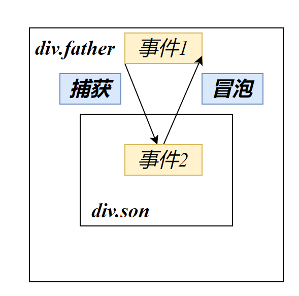
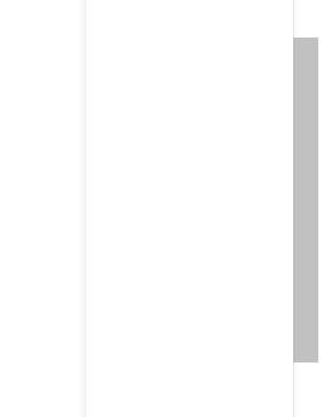
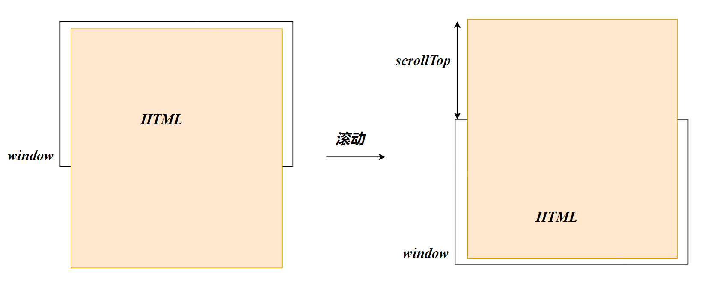

# 事件流

事件流指的是事件完整执行过程中的流动路径。捕获和冒泡是事件执行的两个过程，通常我们会使用冒泡作为事件执行的顺序

捕获：福建->三明市->三明一中

冒泡：三明一中->三明市->福建



## 捕获

启用捕获需要在添加事件时指定第三个参数为`true`

从外部事件开始执行事件到目标事件，**事件类型要求相同**

```js
    document.querySelector('.father').addEventListener('click',function () {
        alert('father')
    },true)
    document.querySelector('.son').addEventListener('click',function () {
        alert('son')
    },true)
```
点击div.son将得到结果：
> **Result:**
>
> 先弹出father，再弹出son


## 冒泡

直接从目标开始执行事件到外部事件，**事件类型要求相同**

```js
    document.querySelector('.father').addEventListener('click',function () {
        alert('father')
    })
    document.querySelector('.son').addEventListener('click',function () {
        alert('son')
    })
```
点击div.son将得到结果：
> **Result:**
>
> 先弹出son，再弹出father

## 阻止事件传播

使用事件对象的方法阻止捕获或冒泡，stopPropagation译为阻止传播

```js
    document.querySelector('.son').addEventListener('click',function (e) {
      e.stopPropagation()
    }
```

## 事件解绑

要移除某个对象的事件监听需要使用`removeEventListener`方法

```js
DOM.对象.removeEventListener('click',事件函数)
```

匿名函数无法解绑

```js
function fun(){
    //事件函数
}
button.addEventListener('click',fun)
button.removeEventListener('click',fun)
```

## 事件委托

类似于现实中的菜鸟驿站

多个相同元素（例如`li`元素）需要进行事件绑定，我们可以使用for循环进行遍历

我们使用事件委托可以只要事件绑定一次，减少注册次数

> 每个DOM元素的事件是客观存在的，默认值为null，当我们对DOM元素进行事件绑定，实际上就是对已存在的事件变量赋值

事件委托的原理就是将事件绑定委托给父元素，当我们触发子元素的时候，会冒泡到父元素身上，从而触发父元素的事件

例如：子元素没有绑定`click`事件，他的`click=null`，触发子元素时，根据冒泡的原理，他会触发父元素的`click`，`click`绑定的事件就可以触发

### 应用

```html
<ul>
    <li>哈哈哈</li>
    <li>哈哈哈</li>
    <li>哈哈哈</li>
    <li>哈哈哈</li>
    <li>哈哈哈</li>
    <p>我不需要事件绑定</p>
</ul>
```

- 事件委托常和事件对象配合使用

`事件对象.target`：获取click点击的DOM对象

```js
    document.querySelector('ul').addEventListener('click',function (e) {
        e.target.style.color='blue'
    })
```

- 排除某个子元素的事件绑定

DOM对象存在属性`tagName`表示当前HTML的标签名，value为全大写的字符串

```js
    document.querySelector('ul').addEventListener('click',function (e) {
        
        if (e.target.tagName==='LI') {
            e.target.style.color = 'blue'
        }
    })
```

## 阻止元素默认行为

```js
<form action="https://www.baidu.com">
    <input type="submit" value="免费注册">
</form>
```

阻止表单的提交：

```js
    document.querySelector('form').addEventListener('submit',function (e) {
        e.preventDefault()
    })
```

# 其他事件

## 页面加载事件

JS事件的执行需要该DOM资源已被加载，因此不能将JS写在DOM资源之前

HTML页面往往需要加载图片资源、外联CSS，JavaScript等。我们需要让所有资源都加载完毕后再触发事件

如果将JS代码写在事件源之前，JS将无法获取该DOM对象

- `load`事件

load译为等待，等待页面所有资源加载完毕，`load`事件被触发

```js
//等待页面所有资源加载完毕，就会执行回调函数
window.addEventListener('load',function(){
 //函数体
})
```

JS写在HTML页面最后就不需要使用该方法了

但是有时候资源的加载缓慢是必然的

```js
img.addEventListener('load',function(){})
```

- `DOMContentLoaded`事件类型

  初始HTML文档被完全加载和解析之后，`DOMContentLoaded`事件被触发，而无需等待CSS、图像资源完全加载

  ```js
  document.addEventListenter('DOMContentLoaded',function(){
      //函数体
  })
  ```

## 页面滚动事件

网页检测到用户移动滚动条后触发页面滚动事件，例如返回顶部，固定导航栏

事件名：`scroll`

```js
window.addEventListenter('scroll',function(){
    	console.log(this.scrollY)
})
```



div也可以有滚动条



获取HTML根标签：`document.documentElement`

```js
window.addEventListenter('scroll',function(){
    	console.log(document.documentElement.scrollY)
})
```

## 页面尺寸事件

- `resize`

  在窗口尺寸改变时触发事件

  ```js
  window.addEventListenter('resize',function(){
      //函数体
  })
  ```

`clientWidth`和`clientHeight`获得元素的可见宽高（不包含border、padding）

`offsetWidth`和`offsetHeight`获得元素的可见宽高（包含border、padding）

`offsetLeft`和`offsetTop`元素的位置
