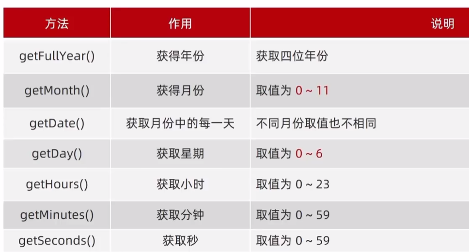
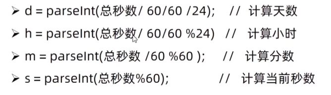

# 事件

用户在网页点击一个按钮就是事件

## 事件监听

我们可以为DOM对象添加事件监听，一旦触发将调用相应的函数进行响应。添加事件监听也称为绑定事件或注册事件

例如鼠标经过显示下拉菜单，点击弹出内容。

### 事件监听三要素

- 事件源：DOM对象
- 事件类型：用什么方式触发事件
- 事件调用函数：事件的具体内容

```js
DOM对象.addEventListener('事件类型',事件调用函数)
```

```js
button.addEventListenter('click',function(){
    alert('点击了')
})
```

## 事件类型

### 鼠标事件

- `click`鼠标点击
- `mouseenter`鼠标经过【没有冒泡】
- `mouseleave`鼠标离开【没有冒泡】

```js
    document.querySelector('div').addEventListener('mouseenter', function () {
        console.log('进入')
    })
    document.querySelector(('div')).addEventListener('mouseleave',function () {
        console.log('鼠标离开')
    })
```

### 焦点事件

焦点指的是输入框中的光标

- `focus`获得焦点
- `blur`失去焦点

```js
document.querySelector('input').addEventListener('focus',function(){
    console.log(获得焦点)
})
```

###  键盘事件

- `keydown`按下按键
- `keyup`弹起按键

建议使用`keyup`，因为存在用户按住不松手的情况

### 文本事件

适用于表单元素

- `input`用户输入内容

```js
//获取用户输入的内容
input.addEventListener('input',function(){
    console.log(input.value)
})
```

- `change`

  用户输入的内容发生改变的时候触发该事件，常用于表单的验证

## 事件调用函数

当我们为某个DOM对象添加了某个类型的对象后

```js
button.addEventListenter('click',function(){
    alert('点击了')
})
```

此时该DOM对象中就成功添加了一个事件调用函数。该代码相当于

```js
click=function(){
    alert('点击了')
}
```

我们可以使用事件类型去调用该事件

```js
button.click()
```

## 事件对象

事件对象存储了事件触发时的相关信息

例如鼠标点击事件（`click`）中，事件对象中存储了鼠标点在哪个位置等信息

用户输入（`input`）时，事件对象中存储了按下了哪些按键

- 创建事件对象：函数的第一个参数就是事件对象

```js
DOM对象.addEventListener('事件类型',function(事件对象){
    
})
```

事件对象常使用*e*，*event*命名

```js
  text.addEventListener('input',function (e) {
	console.log(e)
  })
```

## 事件对象属性

以下为事件对象中的常用成员

- `type` 当前事件的类型
- `clientX`/`clientY`光标相对于浏览器窗口左上的位置
- `offsetX`/`offsetY`光标相对于当前DOM元素左上角的位置
- `key`用户按下的键盘的value

# 环境对象

环境对象指的是函数内部特殊的变量`this`，他代表当前函数运行时所处的环境

每个函数中都存在this，`this`指向了函数的调用者

```js
function fun(){
    console.log(this)//window{...}，window对象
}
fun()
```

```js
  text.addEventListener('input',function (e) {
	console.log(this) //<textarea id="tx" placeholder="发一条友善的评论" rows="2" maxlength="200"></textarea>，DOM对象
  })
```

- 在事件触发的函数中，`this`指向了事件源
- 普通函数则指向了`window`
- 箭头函数没有this

> **应用场景**：
>
> this代表了本DOM对象，就不再需要使用querySelector获取了
>
> ```js
>   document.querySelector('#tx').addEventListener('input',function (e) {
>     let num=this.value.length
>     total.innerHTML=`${num}/200字`
>   })
> ```
>
> 


# 回调函数

回调函数的字面意思为，等待时机成熟，**返回调用的函数**

如果将函数A作为参数传递给函数B，则称函数A这个函数**参数**称为回调函数

例如在定时器中`fun`就是一个回调函数

```js
function fun(){
    console.log('hello')
}
setInterval(fun,1000)
```

事件监听中，事件调用函数也是回调函数


# 事件流

事件流指的是事件完整执行过程中的流动路径。捕获和冒泡是事件执行的两个过程，通常我们会使用冒泡作为事件执行的顺序

捕获：福建->三明市->三明一中

冒泡：三明一中->三明市->福建


## 捕获

启用捕获需要在添加事件时指定第三个参数为`true`

从外部事件开始执行事件到目标事件，**事件类型要求相同**

```js
    document.querySelector('.father').addEventListener('click',function () {
        alert('father')
    },true)
    document.querySelector('.son').addEventListener('click',function () {
        alert('son')
    },true)
```
点击div.son将得到结果：
> **Result:**
>
> 先弹出father，再弹出son


## 冒泡

直接从目标开始执行事件到外部事件，**事件类型要求相同**

```js
    document.querySelector('.father').addEventListener('click',function () {
        alert('father')
    })
    document.querySelector('.son').addEventListener('click',function () {
        alert('son')
    })
```
点击div.son将得到结果：
> **Result:**
>
> 先弹出son，再弹出father

## 阻止事件传播

使用事件对象的方法阻止捕获或冒泡，stopPropagation译为阻止传播

```js
    document.querySelector('.son').addEventListener('click',function (e) {
      e.stopPropagation()
    }
```

## 事件解绑

要移除某个对象的事件监听需要使用`removeEventListener`方法

```js
DOM.对象.removeEventListener('click',事件函数)
```

匿名函数无法解绑

```js
function fun(){
    //事件函数
}
button.addEventListener('click',fun)
button.removeEventListener('click',fun)
```

## 事件委托

类似于现实中的菜鸟驿站

多个相同元素（例如`li`元素）需要进行事件绑定，我们可以使用for循环进行遍历

我们使用事件委托可以只要事件绑定一次，减少注册次数

> 每个DOM元素的事件是客观存在的，默认值为null，当我们对DOM元素进行事件绑定，实际上就是对已存在的事件变量赋值

事件委托的原理就是将事件绑定委托给父元素，当我们触发子元素的时候，会冒泡到父元素身上，从而触发父元素的事件

例如：子元素没有绑定`click`事件，他的`click=null`，触发子元素时，根据冒泡的原理，他会触发父元素的`click`，`click`绑定的事件就可以触发

### 应用

```html
<ul>
    <li>哈哈哈</li>
    <li>哈哈哈</li>
    <li>哈哈哈</li>
    <li>哈哈哈</li>
    <li>哈哈哈</li>
    <p>我不需要事件绑定</p>
</ul>
```

- 事件委托常和事件对象配合使用

`事件对象.target`：获取click点击的DOM对象

```js
    document.querySelector('ul').addEventListener('click',function (e) {
        e.target.style.color='blue'
    })
```

- 指定子元素的事件绑定

父元素中存在很多的子元素，有时候我们只想要部分的子元素执行该事件，则可以添加条件判断：

DOM对象存在属性`tagName`表示当前HTML的标签名，value为全大写的字符串

```js
    document.querySelector('ul').addEventListener('click',function (e) {
        
        if (e.target.tagName==='LI') {
            e.target.style.color = 'blue'
        }
    })
```

## 阻止元素默认行为

```js
<form action="https://www.baidu.com">
    <input type="submit" value="免费注册">
</form>
```

阻止表单的提交：

```js
    document.querySelector('form').addEventListener('submit',function (e) {
        e.preventDefault()
    })
```

# 其他事件

## 页面加载事件

JS事件的执行需要该DOM资源已被加载，因此不能将JS写在DOM资源之前

HTML页面往往需要加载图片资源、外联CSS，JavaScript等。我们需要让所有资源都加载完毕后再触发事件

如果将JS代码写在事件源之前，JS将无法获取该DOM对象

- `load`事件

load译为等待，等待页面所有资源加载完毕，`load`事件被触发

```js
//等待页面所有资源加载完毕，就会执行回调函数
window.addEventListener('load',function(){
 //函数体
})
```

JS写在HTML页面最后就不需要使用该方法了

但是有时候资源的加载缓慢是必然的

```js
img.addEventListener('load',function(){})
```

- `DOMContentLoaded`事件类型

  初始HTML文档被完全加载和解析之后，`DOMContentLoaded`事件被触发，而无需等待CSS、图像资源完全加载

  ```js
  document.addEventListenter('DOMContentLoaded',function(){
      //函数体
  })
  ```

## 页面滚动事件

网页检测到用户移动滚动条后触发页面滚动事件，例如返回顶部，固定导航栏

事件名：`scroll`

```js
window.addEventListenter('scroll',function(){
    	console.log(this.scrollY)
})
```


div也可以有滚动条


获取HTML根标签：`document.documentElement`

```js
window.addEventListenter('scroll',function(){
    	console.log(document.documentElement.scrollY)
})
```

## 页面尺寸事件

- `resize`

  在窗口尺寸改变时触发事件

  ```js
  window.addEventListenter('resize',function(){
      //函数体
  })
  ```

`clientWidth`和`clientHeight`获得元素的可见宽高（不包含border、padding）

`offsetWidth`和`offsetHeight`获得元素的可见宽高（包含border、padding）

`offsetLeft`和`offsetTop`元素的位置

# 日期对象

日期对象可以得到当前的时间

## 实例化

- 当前时间

    ```js
    const date =new Date()
    ```

- 指定时间

  ```js
  const date =new Date('日期字符串')
  ```


## 日期对象方法



```js
date.getFullYear()
```

- `toLocalString`()

  ```js
  date.LocalString()
  ```

  > 2023/10/29 10:23:00

- `toLocalDateString`()

  > 2023/10/29

- `toLocalTimeString`()

  > 10:23:00

## 时间戳

时间戳指的是**1970年01月01日00：00：00**至现在的**毫秒数**

时间戳可以方便时间进行加减运算避免时分秒的转换

获取时间戳：

- `getTime`()

  ```js
  date.getTime()
  ```

- `+new Date()`

  ```js
  +new Date()
  ```

- `Date.now()`

  ```js
  Date.now()
  ```

向获得时间戳的函数中传入未来时间的字符串作为字符串可以得到未来的时间戳，字符串格式没有严格的要求

```js
+ new Date('2023/10/30 00:00:00')
```

## 时间转换



# DOM节点

DOM树中的节点称为DOM节点，节点的关系有父子，兄弟。DOM节点有元素节点、属性节点、文本节点

我们可对DOM节点进行CRUD操作，根据树的结构特点对DOM节点进行操作

## 父节点

获得父节点，找不到返回为null

```js
子对象.parentNode
```

```js
document.querySelector('.son').parentNode
```

使用DOM节点可以方便的批量注册事件

```js
        const adlist = document.querySelectorAll('.box');
        for (let i = 0; i < adlist.length; i++) {
            adlist[i].addEventListener('click',function () {
                this.parentNode.style.display='none'
            })
        }
```

## 子节点

`children`：获得所有的元素子节点

```js
const list=父对象.children
```

list为**伪数组对象**，存在index

## 兄弟节点

- `nextElementSibling`

  上一个兄弟

  ```js
  const li2=li3.nextElementSibling
  ```

- `previousElementSibling`

  下一个兄弟

  ```js
  const li4=li3.nextElementSibling
  ```

## CRUD

### 创建节点

这里指的是创建元素节点

- `createElement`

```js
document.createElement('标签名')
```

```js
const div=document.createElement('div')
```

- `cloneNode`

  克隆的节点需要追加到指定位置
  
  ```js
  DOM对象.cloneNode(boolean bool)
  ```
  
  - `true`克隆时会将后代的DOM节点一起克隆
  
  - `false`克隆时只克隆当前的DOM节点【默认】


### 追加节点

创建节点需要追加至页面才能够显示，追加节点需要通过父节点插入（经过父节点的同意）

- `appendChild`

插入到父节点中：

```js
父节点.appendChild(创建的节点)
```

appendChild将该新建的节点追加至父节点中最后一个子元素的后面

```js
document.body.append(div)
```

- `insertBefore`

插入到父节点中某个子元素的前面

```js
父节点.insertBefore(创建的节点,在哪个子元素前面)
```

```js
//将新li插入到ul的最前面
ul.insertBefore(li,list[0])
```

### 删除节点

在JS中要删除节点必须经过该节点的父节点进行删除（经过父节点的同意）

```js
父节点.removeChild(待删除子节点)
```

```js
const ul =document.querySelector('ul')
ul.removeChild(ul.children[0])
```

# Mobile端事件

移动端存在其自己的事件

## 触屏事件

- `touchstart`手指摸到一个DOM元素触发
- `touchmove`手指在一个DOM元素上滑动时触发
- `touchend`手指从一个DOM元素移开时触发

## Swiper插件

www.swiper.com.cn


