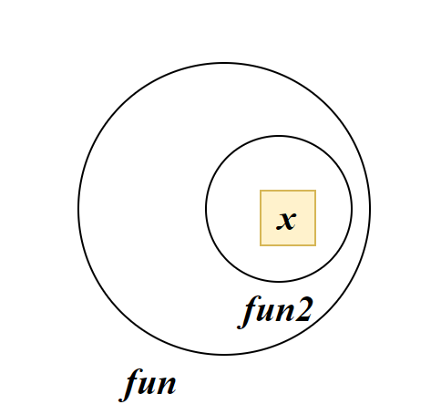

# function

Javascript中的函数主要用于网页中**某个功能的复用**

## 函数声明

```js
function 函数名(形参列){
    函数体
}
```
## 函数参数

```js
function getSum(num1 , num2)
{
    document.write(num1+num2)
}
getSum(10,20)
```

- 形参处相当于执行了let num1和let num2。如果没有赋值，则形参列的类型为`undefined`
- JS中的**实参**可以为**任何类型**，因为JS声明变量时，并不知道变量的类型。

```js
function fun(arr){
    函数体
}
fun([1,2,3])
```

等价于

```js
let arr =[1,2,3]
```

### 默认参数

JS支持使用默认参数以避免调用函数时没有传参。当传入参数时，默认参数将失效

```js
function fun(x=0,y=0){
    函数体//x=0，y=0
}
fun()
```


## 函数返回值

`prompt`是一个函数，他的返回值是用户输入的数据。使用`return`关键字返回值

JS中的返回值不需要声明返回值类型

```js
function sum(a,b)
{
    a=a||0
    b=b||0
    return a+b
}
```

函数可以没有`return`，这种函数的默认返回值为`undefined`

```js
function sum(a,b)
{
    a=a||0
    b=b||0
    a+b
}
let num= sum(1,2)
typeof num //undefined
```

return只能返回一个值，如果要返回多个值则可以封装成数组

```js
return [a,b]
```

## 函数嵌套声明

JS函数可以嵌套声明

```js
function fun1(){
    function fun2(){
        alert('函数嵌套')
    }
    fun2()
}
fun1()
```

**JS函数可以当作一个变量类型**，如果在函数内定义一个函数，相当于在该函数内定义了一个变量，该变量遵从函数作用域，即只能在函数内使用

```js
function fun1(){
    function fun2(){
        alert('函数嵌套')
    }
}
fun2()//fun2 is not defined
```

> **attaction**:
>
> 如果在函数内赋值一个变量，但是该变量没有声明，则JS会将其当作全局变量
>
> ```js
> function fun3(){
>     i=2
> }
> fun3()
> alert(i)//2
> ```
>
> 不建议这样使用，引起该问题的原因是因为JS中可以不声明直接赋值变量
>
> ```js
> j=1
> alert(j)//1
> ```
>
> 

## 调用内部函数

将内部函数作为函数的返回值可调用内部函数

```js
function fun1(){
    let x=1
    return function fun2(){
        console.log(x)
    }
}
let outer=fun1()
outer()
```

# 匿名函数

匿名函数声明：

```js
let 变量名=function (形参列){
    函数体
}
```

匿名函数也称为函数表达式，将匿名函数赋值给一个变量

```js
let res=function(){
    alert('hello,world')
}
```

，使用变量名直接调用匿名函数：

```js
res()
```

## 函数变为表达式

我们知道匿名函数的定义与调用：

```js
let res=function(){
    函数体
}
res()
```

我们可以将匿名函数看作一个整体，在代码中可以将其用括号括起。括号内的表达式将优先计算，而表达式一定要有运行结果，这个结果就是函数本身。当得到函数本身时就可以使用函数`()`调用了

```js
(function(形参列){
    函数体
}) (实参列)
```

该函数会立即执行

```js
(function(x,y){
    alert(x+y)
}) (1,2)
```

> **Attaction**:
>
> 多个立即执行函数之间需要使用`;`分隔，否则会报错。
>
> 为防止出错，建议每个立即执行函数之前都添加一个分号
>
> ```js
>     ;(function () {
>         document.write('立即执行函数1')
>     })()
>     ;(function () {
>         document.write('<br>')
>         document.write('立即执行函数2')
>     })()
> ```
>
> 

## 使用其他符号转为表达式

使用+，!等也可以使函数成为表达式，成为函数表达式之后便可以直接调用

```js
+function(){...}()
 !function(){...}()
 ~function(){...}()
```

其中+的执行效率是最高的

## 立即执行函数的应用

将各自的代码写入立即执行函数中可以避免变量的污染

```js
 ;(function () {
     let i=2
 })()
 ;(function () {
     let i=5
 })()
```

但是使用立即执行函数，将无法访问对方内部的变量

# 回调函数

回调函数，*callback*，并不是指某一种特殊的函数，而是指函数的使用方式

## 同步与异步

同步函数：代码执行顺序与运行顺序一致。

异步函数：代码编写的顺序与运行顺序无关，你无法知道他何时结束

定时器就是一个异步函数：

```js
function f1() {
    setTimeout(function(){
        console.log(111)
    },1000)
    
}
function f2(){
    console.log(222)
}
f1()
f2()
```

> 222
>
> 111


## 回调函数的引入

我们在编写代码中常会遇到这样的问题，希望指定函数运行在异步函数之前。这应该如何解决？

解决方法之一就是将f2的调用放入f1的定时器中，即放入异步函数内部

```js
function f2(){
    console.log(222)
}
function f1() {
    setTimeout(function(){
        console.log(111)
        f2()
    },1000)
}
f1()
```

因此函数开发者常在异步函数中声明一个callback变量表示回调函数

```js
function fun(callback)
{
    callback();
}
```

使用者可以传入一个函数作为参数，该函数在内部会被调用

例如`setTimeout(callback,time)`，在该函数内部会在time时间后自动调用回调函数

# 构造函数

## 构造函数的引入

在Java中 我们可以设计一个类，根据类中的构造函数创建一个对象。但是在JS中没有类的概念，要如何像JAVA一样创建一个对象呢？

虽然我们可以直接使用对象字面量创建对象，但是这并不具有复用性，为此JS借鉴了JAVA的构造方法：

我们可以定义一个函数作为某个对象的构造函数。调用构造函数之后将会得到一个符合我们预期的对象 

## new

创建构造函数，很简单，我们只需要声明一个函数即可

```js
function fun(){
    //your code
}
```

现在该函数还是一个普通函数，但是我们使用new关键字调用它时，我们将会得到一个对象

```js
let obj =new fun()
```

JS执行new时会在构造函数中执行以下代码：

```js
function fun(){
    this={}//创建一个空对象
    //your code
    return this//返回一个对象
}
```

为此你只需要在构造函数中使用this关键字便可以创建属于你自己的对象

为了让开发者知道fun()是构造函数，常在声明构造函数时将方法的首字母**大写**。表示该方法是一个构造函数，需要使用new关键字调用

```js
function User(name,age){
    this.name=name
    this.age=age
}
const user = new User('lai',23);
```

## 类比class

JS的构造函数就相当于Java中的类，使用this添加的成员为public访问权限，使用let声明的变量就当有是`private`私有变量，外界无法无法访问。但是我们可以添加getter和setter方法间接访问（闭包）

```js
function User() {
    let _age=0//私有化变量，不允许外部直接调用
    this.getAge=function () {
        return _age
    }
    this.setAge=function (age) {
        if(age>0) _age=age
    }
}
const user=new User()
user.setAge(12)
console.log(user.getAge());
```


# 闭包函数

## 闭包

闭包*Closure*：在内层函数中使用到了外层函数的变量。

我们可以在函数中嵌套声明一个函数

```js
function fun1(){
    let x=1
    function fun2(){
        console.log(x)
    }
    fun2()
}
fun1()
```

**内部函数+内部函数使用外部变量便可以生成闭包**

## 闭包的应用

闭包的作用在于外部可以访问到内部的变量



当我们在fun中return fun2时，外部就可以访问变量x了

```js
function User() {
    let _age=0//私有化变量，不允许外部直接调用
    this.getAge=function () {
        return _age
    }
    this.setAge=function (age) {
        if(age>0) _age=age
    }
}
const user=new User()
user.setAge(12)
console.log(user.getAge());
```

闭包就是解决我们访问函数内部变量我问题。


# 箭头函数

箭头函数是ES6新增的语法

## 基本语法

箭头函数引入目的是简化函数的书写。箭头函数常用于匿名函数书写的地方

在箭头函数中没有this。

```js
(参数列)=>{
    //函数体
}
```


```js
const fun=function(){
    console.log('hello')
}
```

- 箭头函数，省略了function：

```js
const fun= ( )=>{
    console.log('hello')
}
```

- 当箭头函数中只有一个参数可以省略`()`

  ```js
  x=>{
      console.log(x)
  }
  ```

- 函数体只有一行代码可以省略`{}`

  ```js
  x=> console.log(x)
  ```

- 当唯一的代码是return语句，则return也可以省略

  ```js
  x=> x+x
  //return x+x
  ```

  


# 函数柯里化

```js
function fun(x,y){}
```

假设x只可能存在两个值：1或2

```js
fun(1,111)
fun(1,22222)
fun(2,89)
...
```

我们可以将函数进行进一步封装：

```js
function fa(y){
    fun(1,y)
}
function fb(y){
    fun(2,y)
}
```

我们将函数的变量从2个简化成了1个

```js
fa(111)
fa(22222)
fb(89)
```

JS官方提供了一个解决方案**简化了封装的过程**：

```js
const fa=fun(1)
const fb=fun(2)
```

```js
fa(111)
fa(22222)
fb(89)
```

多个参数的封装

```js
function f(x,y,z){}
const f=fun(1)(2)
f(9)//z=9
```

