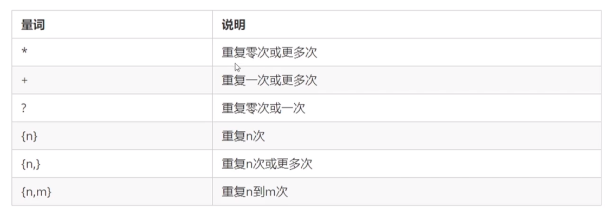
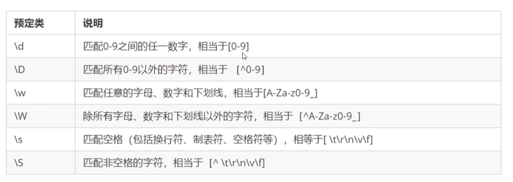

# 正则表达式语法

Regular Expression 正则表达式

## 定义正则表达式

- `/正则表达式/`

  定义一个正则表达式规则对象

```js
const reg=/前端/
```

- `test`

  判断正则表达式与指定规则是否匹配，返回值为布尔值

```js
cosnt str='我们正在学习前端'
reg.test(str)
```

- `exec`

  每次查找符合正则表达式规则的字符串，返回值为数组，没有找到返回null

```js
/hello/.exec('hello world')
```

> ['hello', index: 0, input: 'hello world', groups: undefined]


# 元字符

普通字符：字符串字面量,`'hello'`,`1`,`3`

元字符：是一种具有特殊含义的字符

*a~z*的英文字符：`[a-z]`

A~Z的英文字符：`[A~Z]`

## 边界符

表示位置，必须指定开头、结尾

- `^`表示匹配行首的文本（以谁开始）

  ```js
  /^模式/
  ```

  

- `$`表示匹配行尾的文本（以谁结束）

  ```js
  /模式$/
  ```

  

```js
/^h/.test('hello')
//true
```

```js
/o$/.test('hello')
//true
```

```js
/^哈$/.test('哈哈')
//false
/^你好$/.test('你好')
//true
```

```js
/^h.*o$/.test('hello')
//true
```
- `^`和`$`一起使用则表示**精确匹配**（完全相等）

> **Expression**:
>
> 精确匹配指的是限制了匹配的字符的长度，因为一个模式只会匹配一个字符。
>
> /^哈$/中有一个模式，因此他只能匹配一个长度字符串，且开头和结尾需要满足要求

## 量词

设定某个模式出现的次数。



```js
/^哈*$/.test('哈哈哈')
//true
```

- `+` 重复次数>=1
- `?`重复次数0次或1次
- `{n,}`重复次数>=n
- {n,m}重复次数n~m

## 字符类

- `[]`匹配字符集合，匹配一个字符，该字符在字符集合内

```js
//匹配a，b，c中的一个字符
/^[abc]/.test('ad')
//true
```

```js
/^[abc]{2}$/.test('ab')
//true
```

- 集合中可以使用`-`表示范围

```js
/^[A-Z]$/.test('A')
//true
```

```js
/^[A-Za-z0-9]$/.test('A')
//true
```

- `^`在集合中使用`^`表示取反

```js
//精确匹配：要求开头和结尾都不能是A-Z
/^[^A-Z]$/.test('A')
//false
```

- `.`除了换行符之外的任何字符

## 预定义类



```js
//匹配日期
/^\d{4}-\d{1,2}-\d{1,2}$/
```

# 修饰符

修饰符用于约束正则执行的某些细节，例如是否区分大小写，是否支持多行匹配。

修饰符可以连用，与Linux中的选项用法相同

```js
/正则表达式/修饰符
```
- `i`

  忽略大小写
```js
/^JAVA$/i.test('java')
//true
```

- `g`

  global全局查找
  
  常用于replace方法中

```js
'Java是最好的语言，Java无敌'.replace(/JAVA/i,'PHP')
//PHP是最好的语言，Java无敌

'Java是最好的语言，Java无敌'.replace(/JAVA/ig,'PHP')
//PHP是最好的语言，PHP无敌
```

`g`表示全局查找所有的Java

i表示忽略大小写

# 逻辑

- `|`或

  xxx表示正则表达式

  xxx|xxx  - >  (xxx|xxx) 

```js
 /^[1-9]\d?|100$/
 /(^[1-9]\d?|100$)/
 //以100结尾或1~9开头且第二位为0-9
```

```js
//1-100的数字 
/^([1-9]\d?|100)$/
```


# 应用

验证表单

```js
//匹配大小写数字，-，_
/^[a-zA-Z0-9-_]{4,10}$/
```

关键词替换

```js
字符串.replace(/正则表达式/,'替换的文本')
```

```js
//Java->PHP
'Java是最好的语言'.replace(/JAVA/i,'PHP')
```

提取关键字

