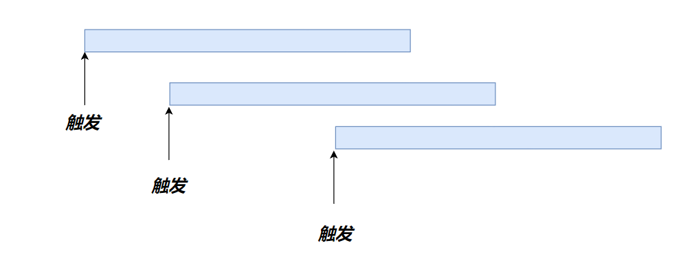
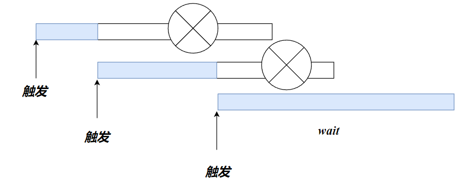
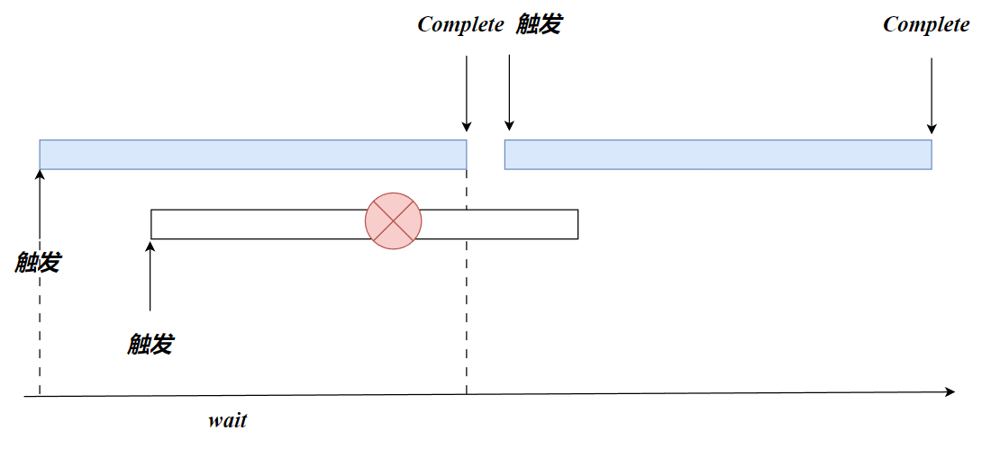

# Lodash

https://www.lodashjs.com/

是一个轻量的JS工具库


# 防抖

## 防抖



`debounce`防抖，频繁触发事件，但是**只执行最后一次**



王者荣耀回城，只要被打断，就需要重新开始。

## 防抖实现

使用`lodash`库的`debounce`函数进行实现：

```js
    function f() {
        console.log('哈哈哈')
    }
    document.querySelector('button').addEventListener('click',_.debounce(f,1000))
```

```js
_debounce(func,wait)
```

创建一个防抖函数，该函数会从上一次被触发后，延迟 `wait` 毫秒后再执行 `func` 方法。多次触发会清零计时，并只执行最后一次。


# 节流

## 节流

throttle，单位时间内，频繁触发事件，只执行最开始的一次



## 节流实现

Lodash提供有节流函数

```js
_throttle(func,wait)
```

在wait秒内，func最多执行一次，且是最开始的一次

