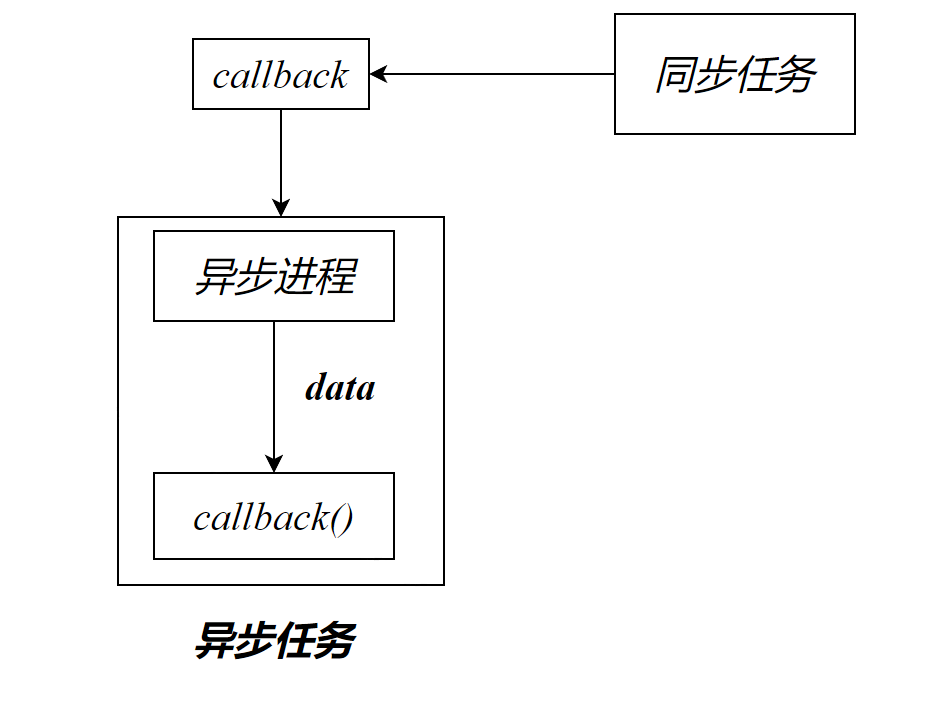
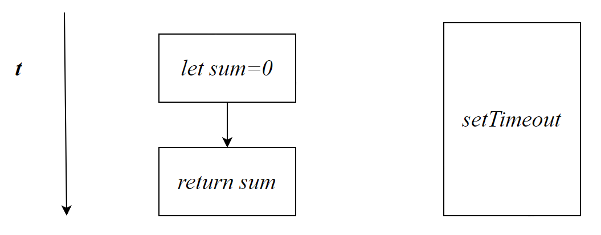
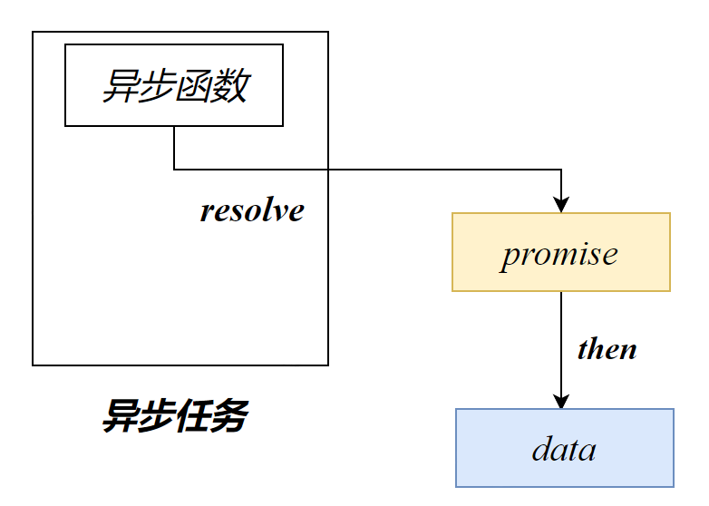
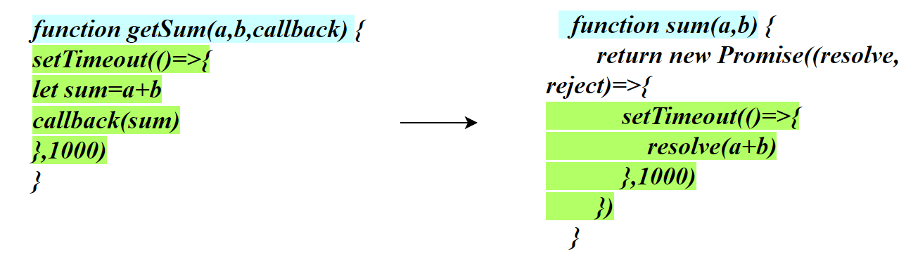
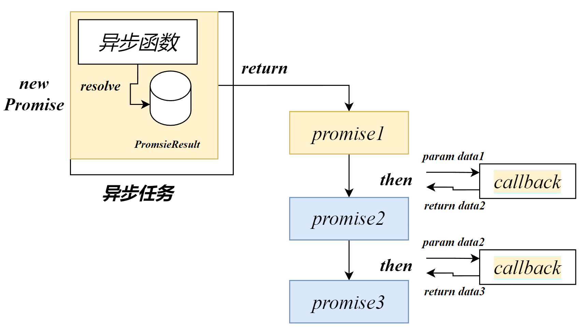
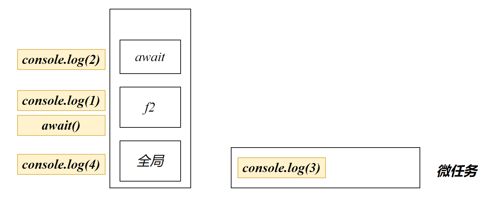

# 回调函数

回调函数，*callback*，并不是指某一种特殊的函数，而是指函数的使用方式：

自己定义的函数类型数据，自己没有调用，但是最终却执行了


## 回调函数的引入

我们在编写代码中常会遇到这样的问题，希望指定函数运行在异步函数之前。这应该如何解决？

解决方法之一就是将f2的调用放入f1的定时器中，即放入异步函数内部

```js
function f2(){
    console.log(222)
}
function f1() {
    setTimeout(function(){
        console.log(111)
        f2()
    },1000)
}
f1()
```

因此函数开发者常在异步函数中声明一个callback变量表示回调函数

```js
function fun(callback)
{
    callback();
}
```

使用者可以传入一个函数作为参数，该函数在内部会被调用

例如`setTimeout(callback,time)`，在该函数内部会在time时间后自动调用回调函数

```js
function f1() {
    console.log('扫地')
}
function f2(callback) {
    setTimeout(()=>{
        console.log('炖老母鸡')
        callback()
    },2000)
}
function f3(){
    console.log('吃鸡')
}

f1()
f2(f3)
```

> *使用回调函数作为形参说明什么？*
>
> 该函数内部会自动调用回调函数
>
> 回调函数能够确保异步执行相关的逻辑（确保逻辑本质就是因为同步任务需要异步的结果）
>
> 回调函数中的参数用于接收函数内异步的数据（**异步的结果必须使用回调函数接收结果**）
>
> 总结：回调函数用于接收异步得到的结果



## 回调地狱

在异步函数内的数据，无法使用`return`获得

尝试解决：

由于let sum=0和return sum是同步执行的，而setTimeout是异步执行的，因此无法使用闭包返回结果

```js
function getSum(a,b) {
    let sum=0
    setTimeout(()=>{
        sum=a+b
    },1000)
    return sum
}

console.log(getSum(10, 20));
```



使用回调函数，用于获取将异步的结果

```js
function getSum(a,b,callback) {
    setTimeout(()=>{
        let sum=a+b
        callback(sum)
    },1000)
}

getSum(10,20,(res)=>{console.log(res)})
```

如果需要对异步得到的数据进行进一步的异步处理，则需要在回调函数中再调入一个异步处理函数（data在回调函数中）

```js
    getSum(10,20,(res1)=>{
        fun2(res1,(res2)=>{
            fun3(res2,(res3)=>{
                console.log(res3)
            })
        })
    })  
```

第一个res的将当前回调函数得到的结果传入下一个异步任务fun2，第二个res是回调函数中用于接收异步得到的结果

```js
getSum(10,20,(res)=>{
    getSum(res,2,(res)=>{
        getSum(res,3,(res)=>{
            getSum(res,4,(res)=>{
                console.log(res)
            })
        })
    })})
```

回调地狱的可读性极差

# Promise

## Promise引入

我们需要Promise**代替回调函数**给我们得到异步的结果

Promise用于存储异步调用的结果，它是一种特殊的存储数据的容器



promise由于是根据异步任务获得的数据，因此他一定能够得到异步调用得到的数据结果。

## 创建Promise

```js
const promise=new Promise(func)
```

- `func` 函数作为构造函数的参数
- 创建`promise`对象时，该回调函数会自动执行
- `func`存在两个参数：
  - `resolve` 函数类型参数，执行正常时，向promise对象存储数据
  - `reject` 函数类型参数，执行错误时，向promise对象存储数据
  - resolve和reject中的形参为向promise存储的数据

```js
const promise=new Promise((resolve,reject)=>{
    console.log('回调函数执行了')
    resolve('数据')
})
```

> 回调函数执行了


通过函数向promise添加数据，可以添加异步得到的数据

## 读取数据

### then

then译为然后

通过Promise的实例方法`then`从Promise读取数据

```js
promise.then(result,reason)
```

- `result`回调函数，用于获取resolve存储的数据
- `reason`回调函数，用于获取reject存储的数据

```js
promise.then((res)=>{
    console.log(res)
})
```

```js
const promise=new Promise((resolve,reject)=>{
    setTimeout(()=>{
        resolve('异步参数')
    })
    console.log('回调函数执行了')
})
promise.then((res)=>{
    console.log(res)
})
```

### catch

获得Promise中的异常数据，catch只有一个参数，就是reason

```js
promise.catch(reason)
```

- reason：回调函数，得到异常数据

相当于：

```js
promise.then(null,reason)
```

### finally

无论是正常存储的数据还是异常，finally都会执行

finally的回调函数中，无法获得Promise参数

```js
promise.finally(()=>{
    console.log('我会始终执行')
})
```

### Return

使用then、catch、finally获取数据将会返回一个新的Promise对象

在then、catch中的回调函数中，我们使用`return`关键字可以给新的`Promise`对象传值（promise state为`fulfilled`）

```js
    const promise=new Promise((resolve, reject)=>{
        resolve('初始数据')
    })
    promise.then(result => {
        console.log(result)
        return '第二个数据'
    })
        .then(result=>{
            console.log(result)
            return'第三个数据'
        })
        .then(result=>{
            console.log(result)
            return '第四个数据'
        })
        .then(result=>{
            console.log(result)
        })
```

> 初始数据
> 第二个数据
> 第三个数据
> 第四个数据

## 存储数据

```js
const promise=new Promise((resolve,reject)=>{
    resolve('数据')
})
```

创建一个立即完成的Promise对象

```js
Promise.resolve('数据')
```

```js
Promise.reject(错误信息)
```

## Promise结构


### PromiseResult

真正存储异步结果的属性


### PromiseState

Promise的状态，用于描述PromiseResult中的数据的状态

- `fulfilled`完成状态（使用`resolve`接收异步结果时，`pending`->`fulfilled`）
- `rejected`拒绝状态（使用`reject`接收异步结果时，`pending`->`rejected`）
- `pending`，promise数据的初始状态，还没有收到异步的结果。

`PromiseState`属性只能修改一次，当Promise创建时，PromiseSatae初始值为pending


## 使用 Promise封装异步任务




## Promise解决回调地狱



```js
    function sum(a,b) {
        return new Promise((resolve, reject)=>{
            setTimeout(()=>{
                resolve(a+b)
            },1000)
        })
    }
    sum(1,2).then(result=> result+3)
        .then(result=>result+4)
        .then(result=>result+5)
        .then(result=>result+6)
        .then(result=>console.log(result))
```

```js
  function f() {
      return new Promise((resolve, reject)=>{
          setTimeout(()=>{
              resolve('炖老母鸡')
          },1000)
      })
  }
  f().then(result=>{
      console.log(result)
      return '吃鸡'
  })
      .then(result=>{
          console.log(result)
          return '洗碗'
      })
      .then(result=>{
          console.log(result)
      })
```

## 穿透

```js
    const promise=new Promise((resolve, reject)=>{
        resolve('first')
    })
    promise.then(res=>'second')
        .then(res=>'third')
        .catch(res=> console.log(res))
        .then(res=>console.log(res))
```

当catch没有捕获到异常信息将自动跳过catch语句的执行

同理 then用于获取正常的信息，如果没有获取到，则跳过then语句。

当promise出现异常，而调用链中没有catch捕获，则异常向外抛出，程序将会报错

通常会将catch写在调用链的最后

# Promise API

## Promise.all

```js
Promise.all(iterable promise)
```

- `iterable promise` Promise对象数组

- `return`：一个新的Promise对象，存储有多个Promise的数据

Promise对象数组中只要有一个对象的数据是rejected，则会报错

而`Promise.allSettled()`无论是否有错误，都会返回Promise对象

## Promise.race

```js
Promise.race(iterable promise)
```

- `iterable promise` Promise对象数组
- `return`：返回**最快得到的promise对象**，如果速度相同，则按声明顺序决定

```js
    Promise.race([
        // Promise.resolve(2222),
        Promise.reject(1111),
        sum(1,2),
    ])  .then(result=>console.log(result))
        .catch(result=>console.log(result))
```

> 1111


race得到的promise不考虑对错，只考虑速度。接收rejected类型的promise需要使用catch获得

## Promise.any

```js
Promise.any(iterable promise)
```

- `iterable promise` Promise对象数组
- `return`：返回**最快得到的promise对象**，如果速度相同，则按声明顺序决定

any得到的promise只要`fulfilled`状态的（rejected状态的promise对象被过滤），且考虑速度。

```js
    Promise.any([
        Promise.reject(1111),
        // Promise.resolve(2222),
        sum(1,2),
    ])  .then(result=>console.log(result))
        .catch(result=>console.log(result))
```

> 3


# async

`async/await` 是一种更现代、清晰的异步编程方式，可以使异步代码看起来更像同步代码

## async

`async`，译为异步的。

`async`用于帮助我们快速创建返回类型为Promise对象的函数，即异步函数。

```js
async function 函数名(){}
```

- 如果没有写return，async会返回一个空的Promise对象
- return value，sync会将该value封装至Promise对象中

```js
async function f() {
    return 1
}
f().then((a) =>{console.log(a)})
```

等价于下面的写法：

```js
function f() {
    return Promise.resolve(1)
}
f().then((a) =>{console.log(a)})
```

- 显式return promise对象，常搭配Promise的构造函数

```js
async function f() {
  return new Promise((resolve, reject) => {
    setTimeout(() => {
      resolve('炖老母鸡');
    }, 1000);
  });
}
```

## await

在**async函数**中，可以使用 `await` 来等待并获取异步的结果，而不必使用回调函数。

awit 会暂停代码的执行，得到异步结果后才会继续执行下面的代码

```js
Promise中的value=await promise对象
Promise中的value=await 异步函数(async)
```

他的本质还是使用then获取异步结果

```js
promise对象.then(callback)
```

```js
! async function(){
    const res=await f()
    console.log(res)
    console.log('吃老母鸡')
}()
```

> 为保证同步函数能够正常执行，不会被阻塞，await只能用在async声明的异步函数中，await会阻塞其后面的代码的执行。
>
> 在异步函数await后的代码肯定是需要前面的异步结果才能够继续执行的，因此将其放在了await后面。如果与异步结果无关，可以将代码写在await之前，防止其被await阻塞


> *Grammer*：
>
> 当`await`后面修饰的不是`promise`对象，会首先执行该同步语句，再执行`await Promise.resolve(undefined)`
>
> await后面的语句的执行逻辑：
>
> 当promise的状态为`fulfilled`时会将后面的语句放入微任务队列中
>
> 【即使用了`await`得到的`promise.then(后面的语句)`】
>
> ```js
> async function f2() {
>     console.log(1)
>     await console.log(2)
>     console.log(3)
> }
> f2()
> console.log(4)
> ```
>
> > 1243
>
> 

## try -catch

`async`和`awit`使得异步编程与同步编程相似，因此我们可以使用try-catch对其进行异常处理

