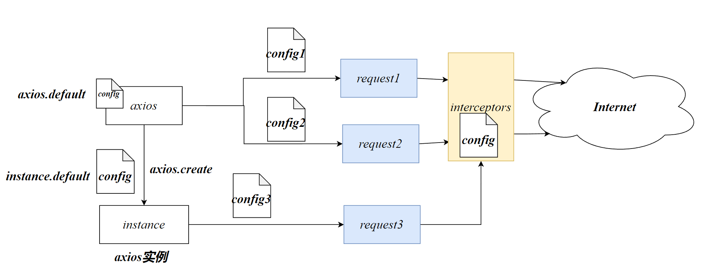

# Rest

*REpresentational StateTransfer* 表示层状态传输。

REST是一种服务器的设计风格，REST的推出导致了当今前后端分离的趋势

Rest建议服务器只返回数据至前端，视图的渲染由前端负责

数据的传输使用*JSON*格式的字符串传输


# 请求方式

## GET

加载数据

## POST

新建或添加数据

## PUT

添加或修改数据

## PATCH

修改数据

## DELETE

删除数据

## OPTION

由浏览器自动发送，用于检查请求的一些权限


## Rest API

```js
请求类型 path
```

GET /user

# 状态码


# AJAX

发送异步请求（JS和XML）

Axios实现AJAX

## XHR

在前端Web应用中写的JS代码

发送请求：

```js
// 创建一个新的XHR对象，xhr表示请求信息
const xhr = new XMLHttpRequest()
// 设置请求信息
xhr.open('GET','http://localhost:8080/students')
// 发送请求
xhr.send()
```

获得响应数据：

```js
xhr.response
```

考虑到请求是需要一定的时间获取，因此需要考虑异步

```js
xhr.onload=function(){
    if(xhr.status===200)//响应状态码
   		 console.log(xhr.response)
}
```


## 后端解决跨域

向响应报文中添加信息：

```js
res.setHeader('Access-Control-Allow-Origin',URL)
```

URL通常写前端Web应用的URL

设置跨域支持的Methods类型

```js
    res.setHeader('Access-Control-Allow-Methods','GET, POST, PUT, DELETE')
```

设置跨域支持的头部信息

```js
    res.setHeader('Access-Control-Allow-Headers', 'Content-Type')
```


# fetch

对xhr进行了封装，使用了Promise API ，原生JS就支持fetch

## 发送请求

```js
fetch(URL,options)
```

- `options` **配置对象**

```js
fetch('http://localhost:8080/students')
    .then((res) => {
        if (res.status === 200)
            return res.json()
        else throw new Error('请求错误')
    })
    .then((r) => {
        console.log(r)
    })
    .catch((err) => {
        console.log(err)
    })
```

```js
res.json()
```


```js
{
   method:'请求方式'
    body:'JSON字符串'
    headers:{
        'Content-type':'application/json'
    }
}
```

`header`：请求体类型

## 请求终止

创建控制器：

```js
const controller=new AbortController()
```

fetch注册控制器

```js
fetch('http://localhost:8080/students',{
    signal:controller.signal
})
```

使用控制器终止请求

```js
controller.abort()
```

防止controller为null

```js
controller&& controller.abort()
```

```js
const controller=new AbortController()
setTimeout(() =>{
    controller.abort()
},3000)
fetch('http://localhost:8080/students',{
    signal:controller.signal
})
```


# 存储

## Cookie

Rest风格中 Cookie由于跨域问题，并不作为主流使用

## 本地存储

### sessionStorage

当当前页面关闭，会话存储就会消失


### localStorage

存储时间较长

- `setItem ('key','value')`存储数据
- `getItem('key')`获取value
- `removeItem('key')`删除数据
- `clear()`清空数据


## 本地存储问题

### 安全问题

本地存储的数据是明文的，存在数据安全问题。

### 服务器无法得到状态

使用本地存储存储登录的状态，但是本地存储是在浏览器中，服务器怎么知道我已登录？服务器需要判断你是否登录以便决定是否给你提供服务

# token认证

rest风格的服务器是**无状态的服务器**，所以不要在服务器中存储用户的数据。可以将用户信息发送给客户端保存

客户端每次访问服务器时，直接将用户信息发回，服务器可以根据用户信息来识别用户的身份

同时我们需要存储在客户端的数据进行加密，加密以后再发送给客户端保存，这样可以避免数据的泄露

加密算法写在服务器。因此如果不知道加密算法将无法解析用户数据

在node环境中，可以直接使用*jsonwebtoken*（*JWT*）模块对json加密，生成一个web中使用的令牌

## jwt

### sign

```js
const token=jwt.sign(obj,privateKey,{expiresIn: '1'})
```

- `obj`：加密数据

- `privateKey`：String，私钥。使用私钥进行加密和解密

  私钥通常使用随机生成的string

- `option`配置项

  - expiresIn 加密的有效时间

### verify

对token进行解密

```js
const res = jwt.verify(token, privateKey)
```

- `token`：加密得到的String
- `privateKey`私钥

当解密已过期的token时，verify将会抛出异常，因此我们需要使用try-catch捕获

```js
try {
    const res = jwt.verify(token, privateKey)
    console.log(res)
} catch (e) {
    console.log('Token已过期')
}
```

## tips

虽然token是加密的，但是还是不要传敏感数据，例如密码，防止token就算被非法解密，也没有什么问题

## header

token信息主要用于身份认证，常放置在请求头的`authorization`中：

```js
fetch('http://localhost:8080/student',{
                method:'GET',
                headers:{
                    'authorization':`Bearer ${token}`
                }
            })
```

我们需要在服务器开启：

```js
res.setHeader('Access-Control-Allow-Headers', 'Content-Type,Authorization')
```

authorization字段的格式有要求：

```js
Bearer 信息
```

# Axios

官方文档：https://www.axios-http.cn/docs/intro

Axios 是一个基于 *promise* 的网络请求库，可以用于浏览器和 node.js。在浏览器中Axios是基于XHR进行的封装

CDN引入浏览器环境：

```js
<script src="https://cdn.jsdelivr.net/npm/axios/dist/axios.min.js"></script>
```



## axios实例

axios是Axios的一个实例对象，用于Axios中所有请求的发送与接收。我们使用`axios`这个变量即可使用该实例

除了默认的axios实例，我们还可以创建另外的axios实例，用于一些特殊的请求。

```js
axios.create(config)
```

axios的默认配置。实例也会生效。但是我们针对该实例进行单独的配置

## 发送请求

```js
axios(config)
```

使用axios将得到promise封装的响应数据

向 `axios` 传递相关配置来创建请求

```js
// 发起一个post请求
axios({
  method: 'post',
  url: '/user/12345',
  data: {
    firstName: 'Fred',
    lastName: 'Flintstone'
  }
});
```

如果是get请求，则自动向url添加参数

如果是post请求会将data自动转为json格式

axios得到的promise对象中的value已自动转为了JS对象，该对象为**响应报文对象**数据域位于data中

axios默认只会在响应状态码为2XX时才会调用then（获得异步结果）否则会抛出异常。

### 默认GET请求

```js
axios(url[, config])
```

```js
// 发起一个 GET 请求 (默认请求方式)
axios('/user/12345');
```

## 其他请求的省略写法

```js
axios.post(url[,config])
axios.put(url[,config])
```


## config

axios中的一个配置对象，在不传入config时会使用默认的配置

### config的覆盖

在开发中我们可以在很多的地方设置config，但是只有设置的config中的属性相同时，才会覆盖

```js
axios.defaults.baseURL = 'http://localhost:8080'
const res=await axios({
    baseURL:'http://localhost:8081'
    url:'/login',
    method:'post',
    data:{
        username:'admin',
        password:'123456'
    }
```

8081的baseURL将会将原来的value覆盖。

### data

作为请求体中被发送的数据。data一般使用指定格式的JS对象

*仅适用 'PUT', 'POST', 'DELETE 和 'PATCH' 请求方法*

### url

config中只有url是必须的

```js
url: '/user'
```

### baseURL

将自动添加在url前面，常指定域名

```js
baseURL: 'https://some-domain.com/api/
```


### headers

headers用于设置请求头各个key的value，他是一个对象

```js
headers: {'X-Requested-With': 'XMLHttpRequest'},
```

```js
'Content-Type':'application/json'
```


### transformRequest/Response

用于处理请求或接收的数据data

```js
transformRequest(array)
```

- array：函数类型的数组。接收多个函数，并按照顺序对data进行处理

- function(data,headers)

  - data 数据【每一个handler中需要使用return data

    最后一个handler需要将data转为JSON字符串】

  - headers请求头

### timeout

超时时间，时间一到，将取消请求

### signal

绑定控制器controller，根据controller手动控制请求的取消

### params

`params` 用于GET请求设置参数

```js
 axios.get('https://api.example.com/data', {
  params: {
    key1: 'value1',
    key2: 'value2',
  }
})
```

```js
https://api.example.com/data?key1=value1&key2=value2
```

## 响应对象

axios会将响应报文自动转为一个响应对象并存储在Promise中

响应对象的结构如下：

```js
{
  // `data` 由服务器提供的响应
  data: {},

  // `status` 来自服务器响应的 HTTP 状态码
  status: 200,

  // `statusText` 来自服务器响应的 HTTP 状态信息
  statusText: 'OK',

  // `headers` 是服务器响应头
  // 所有的 header 名称都是小写，而且可以使用方括号语法访问
  // 例如: `response.headers['content-type']`
  headers: {},

  // `config` 是 `axios` 请求的配置信息
  config: {},

  // `request` 是生成此响应的请求
  // 在node.js中它是最后一个ClientRequest实例 (in redirects)，
  // 在浏览器中则是 XMLHttpRequest 实例
  request: {}
}
```

响应传递的JSON字符串会转为对象存储在data中

## 默认配置

考虑到在一个应用中，很多的配置都是相同，我们可以设置他的默认值，这样在后续的axios使用就不再需要专门设置该配置项了

### 全局默认配置

```js
axios.defaults.baseURL=‘http://localhsot:8080’
axios.defaults.headers.common['Authorization']=`Bearer ${token}`
```

common指的是通用类型的请求（get、post、put、delete）

### 自定义实例默认配置

```js
const instance=anxios.create(config)
instance.defaults.headers.common['Authorization'] = AUTH_TOKEN;
```

## axios 拦截器

与express的中间件类似。我们可以对请求或响应进行拦截以便进行处理。

```js
// 添加请求拦截器
axios.interceptors.request.use(function (config) {
    // 在发送请求之前做些什么
    return config;
  }, function (error) {
    // 对请求错误做些什么
    return Promise.reject(error);
  });

// 添加响应拦截器
axios.interceptors.response.use(function (response) {
    // 2xx 范围内的状态码都会触发该函数。
    // 对响应数据做点什么
    return response;
  }, function (error) {
    // 超出 2xx 范围的状态码都会触发该函数。
    // 对响应错误做点什么
    return Promise.reject(error);
  });
```

- config 配置项
