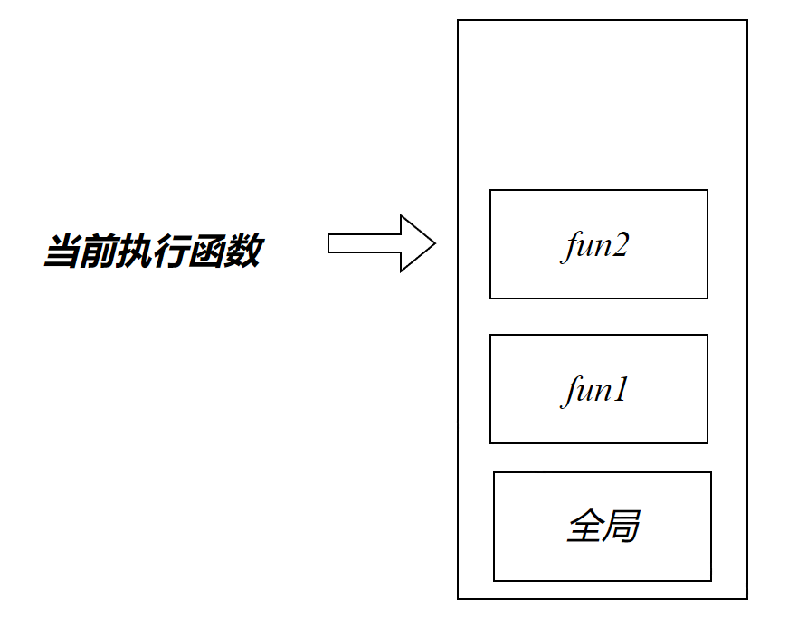

# JS单线程机制

## JS与浏览器

JS 是单线程的，也就是同一个时刻只能做一件事情。

因为浏览器是多线程的，当 JS 需要执行异步任务时，浏览器会另外启动一个线程去执行该任务。也就是说，“JS 是单线程的”指的是执行 JS 代码的线程只有一个，是浏览器提供的 JS 引擎线程（主线程）。浏览器中还有定时器线程和 HTTP 请求线程等，这些线程主要不是来跑 JS 代码的。

比如主线程中需要发一个 AJAX 请求，就把这个任务交给另一个浏览器线程（HTTP 请求线程）去真正发送请求，待请求回来了，再将 callback 里需要执行的 JS 回调交给 JS 引擎线程去执行。**即浏览器才是真正执行发送请求这个任务的角色，而 JS 只是负责执行最后的回调处理。**所以这里的异步不是 JS 自身实现的，其实是浏览器为其提供的能力。


## 同步与异步

大部分的JS语句都是同步执行的，例如 创建变量、对象

异步主要有宏任务和微任务

同步代码的执行可能会造成阻塞的现象。JS使用异步去解决，Java使用多线程去解决

## 宏任务与微任务

### 宏任务

宏任务会将callback送入宏任务队列

- setTimeout()
- setInterval()
- setImmediate()
- ajax


### 微任务

微任务会将callback送入微任务队列

- promise.then
- promise.catch


# 事件循环机制


## 调用栈(Call stack)

函数在每次执行时，都会入栈。函数执行完成后将会出栈



```js
function fun1(){
    fun2()
}
fun1()
```


## 消息队列（宏任务队列）

当栈空时，消息队列中的callback将会进入调用栈执行。


```js
setTimeout(() => {
    console.log(1)
},0)
```

setTimeout为宏任务，他会将匿名回调函数和时间送至浏览器处理，定时器到时后会将callback送至消息队列排队等候

## 微任务队列

Promise在then、catch会将回调函数将会进入微任务队列中，而不会进入消息队列

当栈空时，会将微任务队列中的函数压入栈执行，**当微任务队列为空时，再将消息队列中的函数压入栈**【即只要微任务队列不为空，就不会轮到消息队列的函数入栈】

```js
setTimeout(() => {
    console.log(1)
},0)
Promise.resolve(1).then(() =>{console.log(2)})
console.log(3)
```

> 3 2 1


### queueMicrotask

```js
queueMicrotask(callback)
```

- 将callback添加至微任务队列

```js
queueMicrotask(() =>{console.log(4)})
```

### 任务分析

```js
function A() {
    console.log(1)
}
function B() {
    console.log(2)
}
function timer() {
    setTimeout(A)
}

Promise.resolve().then(timer)
queueMicrotask(B)
```

### promisestate

```js
    function sum(a,b) {
        return new Promise((resolve, reject)=>{
            setTimeout(()=>{
                resolve(a+b)
            },1000)
        })
    }
    sum(1,2).then(result=> result+3)
        .then(result=>result+4)
        .then(result=>result+5)
        .then(result=>result+6)
        .then(result=>console.log(result))
```


1. 当 Promise 的状态从等待（pending）变为已完成（fulfilled）时，与之相关的 `then` 回调将会被添加到微任务队列中。
2. 当 Promise 的状态从等待（pending）变为已拒绝（rejected）时，与之相关的 `catch` 或 `then` 的第二个参数（处理 rejected 状态的回调）将会被添加到微任务队列中。
3. 当使用resolve接收异步得到的结果时，pending->rejected
