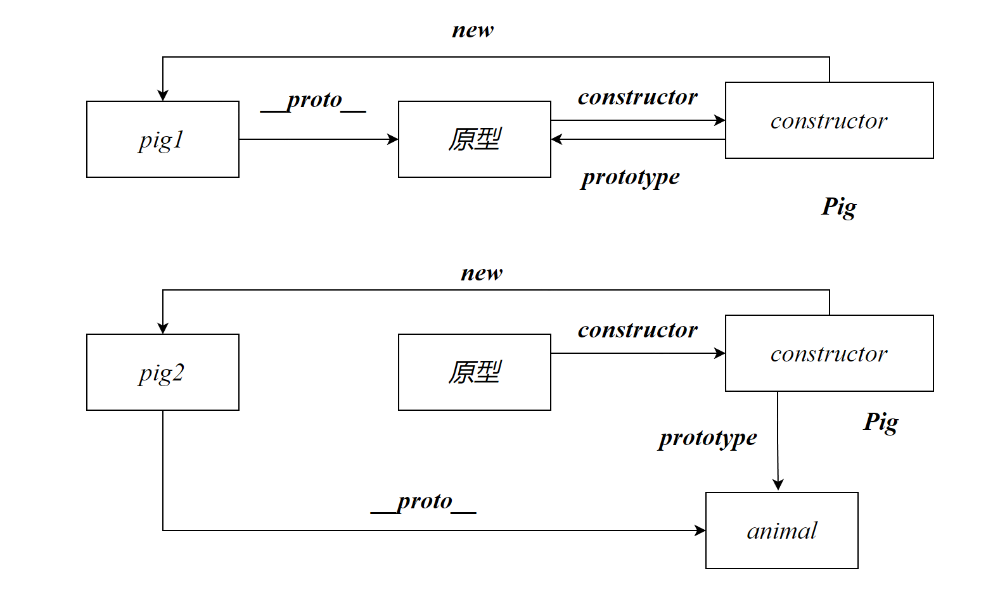

# 对象的结构

要学习原型，就需要对对象的结构有一个基本的了解：


# 原型

## 什么是原型

原型是一个存储类的内部参数的空间。原型也是一个对象。每一个对象实例都有该类的原型对象的地址。

原型对象主要存储对象实例的公共方法和属性以节省实例的存储空间


## [[Prototype]]

英文为*prototype*，在早期的JS中使用`__proto__`表示原型，这样命名是想让开发者知道这是对象内部使用的属性，不希望开发者能够直接调用。但是我们依旧能够通过对象进行调用：

```js
pig.__proto__
```

因此在新的JS规范中使用了`[[Prototype]]`表示原型，由于其属性名的特殊性，我们无法使用对象属性调用的两种方式得到他。这样一定程度避免了开发者使用它。

但是`__proto__`属性依旧存在在*Object*的原型中


我们通过原型链依旧可以使用`__proto__`属性，但是我们应该尽量避免使用该方法获得原型。因为这种方法获得的原型可以被直接修改！

## prototype

所有类都有的**静态属性**，指向了某个类的原型对象。静态属性存储在原型的constructor属性中

由于是静态属性，因此可以直接使用类名调用：

```js
类名.prototype
```

> 为什么不建议使用`__proto__`获得原型？
>
> 这是因为原型是类的，通过某个对象获得原型并进行修改是不合逻辑的
>
> 如果对某个对象的`__proto__`重新赋值将不会影响其他对象的`__proto__`
>
> ```js
> pig.__proto__={}
> console.log(pig2.__proto__)
> ```
>
> 

## getPrototypeOf

使用Object的静态方法可以获得某个对象的原型，该原型是只读的，因此使用该方法获得的原型是安全的

```js
Object.getPrototypeOf(对象实例)
```

```js
console.log(Object.getPrototypeOf(pig))
```


# 原型的结构

## constructor

在ESS6之前，都是使用构造函数创建的对象，因此在旧类中构造函数就类似于类的定义。

一个类的构造函数，存储在类的原型中。在构造函数中声明一个变量，且没有使用this修饰，就声明了一个类的静态属性。

```js
    function Dog(name,age){
        let count=21
        this.name=name
        this.age=age
    }
```

name和age都是实例属性，count是静态属性。静态属性只能使用类进行访问

```js
类名.静态属性名
```

```js
Dog.count
```

静态属性存储在constructor对象中，因此也可以这样描述：

```js
dog.__proto__.constructor.count
```

## 私有属性

私有属性不存储在原型中，在这里说明只是为了便于比较。私有属性又称实例属性

- 直接通过对象所添加的属性为实例属性
- 在class中使用x=y（构造函数外）得到是实例属性

## 公共属性

**公共属性指的是对象间相同的属性**，即`key`相同，`value`也相同

在原型对象存储的属性称为公共属性，constructor就是一个公共属性

- 在class中使用**简写方式声明的函数**将会存储原型对象中

```js
    class Pig {
        constructor(name,age) {
            this.name=name
            this.age=age
        }
        static props='静态属性'
        sayHello(){
            console.log('Hello')
        }
    }
```

sayHello将存储在类的原型中

- 我们也可以直接向原型对象中添加属性使其成为公共属性：

```js
pig.__proto__.sayBye=function (){
    console.log('Bye')
}
pig.__proto__.count=12
```


当我们访问对象中的属性时，会优先访问对象自身的属性，对象自身不包含该属性时，才会去原型对象中寻找


# 原型链

## Object的原型

Object的原型中存储了Object中的所有公共方法，Object原型也有原型，但是它的值为`null`

没有实例属性的Object对象是所有对象的父对象，是万物之主

## 对象继承

JS中的继承与Java中的继承不同，Java中指的是类的继承，而在JS中指的是对象的继承，即继承对象中的属性

例如

存在Pig实例：

```js
const pig1={name:'小猪佩奇',age:'12',color:'pink'}
const pig2={name:'猪爸爸',age:'20',color:'pink'}
```

由于color是相同的，因此我们可以将`color`存储至Pig的原型中

```js
Pig.prototype.color='pink'
```

如果公共的属性较多，我们也可以将其封装成一个对象

```js
animal={color:'pink'}
Pig.prototype=animal
```

一个对象可以被多个子对象继承：

```js
Pig.prototype=animal
Bird.prototype=animal
Bird.prototype.fly=true
```

这样会存在一个问题：改变原型会影响其他的子对象，因此我们可以使用构造函数创建不同的子对象：

```js
Pig.prototype=new Animal()
Bird.prototype=new Animal()
```

在JS中通过将某个实例赋值给某个类的原型对象实现了对象的继承

```js
Cat.prototype=new Animal()
```

>  因此某个类的原型可以理解为**对象的公共属性集合**，这个公共属性就是一个父对象



## 为什么不使用静态属性

根据JS对象的继承，对象的父对象实际上就是公共属性的封装，那为什么不将公共属性封装成静态属性呢？

```js
Pig.color='pink'
```

这就要从JS的静态属性的原理说起了，在JS中静态属性虽然存储在`constructor`对象中，但是我们却无法在构造函数中添加静态属性：

```js
//试图添加id作为静态属性   
function Pig(name,age){
        const id=10
        this.name=name
        this.age=age
        this.sayHello=function (){
            console.log('hello')
        }
    }
```

只能使用`this`关键字做到类似的效果，但是这会造成空间的浪费：

```js
function Pig(name,age){
        this.id=10
        this.name=name
        this.age=age
        this.sayHello=function (){
            console.log('hello')
        }
    }
```

只能使用类进行添加：

```js
Pig.id=10
```

因此推测：JS的创始人可能觉得公共属性应该属于对象层面，而不应该在类层面，即：使用**对象.属性**能够直接获取到公共属性，而不应该使用类才能够获取。

## 原型链

原型对象也是对象，因此其也有原型。这样就构成了一条原型链，根据对象的复杂程度的不同，原型链的长度也不同。

Object对象是所有对象的父对象，它的原型中存在Object对象的公共方法，Object原型也是对象，也存在原型，但是它的原型为*null*


读取对象属性时，会优先从对象自身的属性中寻找，如果对象自身不存在该属性，则从对象的原型中寻找，如果对象的原型中没有，则会从对象的原型的原型中寻找，依次类推。


# 原型的作用

同类型的原型是同一个原型对象

原型就相当于是该类的公共区域，存放相同的属性和方法

JS中的继承就是根据原型来实现的：子类的原型就是父类的实例


## 修改原型


该代码的底层思想：通过修改p一个对象的原型而影响到该类的所有实例并不合适。

因此不建议使用类的实例去修改原型

```js
p.__proto__=新原型
```

此时p对象的原型被修改，但是其他对象则不会受到影响

可以通过类的静态属性prototype可以访问原型

```js
类名.propotype
```

修改原型时，建议使用该方法修改

# 原型方法

## in

判断属性是否存在在某个对象中，并返回布尔值。in会根据原型链不断寻找该属性

```js
属性名 in 对象
```

属性名需要写成字符串的形式

```js
'name' in pig
```

静态属性不存在在对象实例中

```js
'color' in pig
//false
```

## hasOwnProperty

Object原型中的方法，用于检查对象自身是否包含该属性。即不从原型中寻找。

in则会从原型中寻找

## hasOwn

Object的静态方法，用于取代hasOwnProperty

```js
Object.hasOwn(对象,属性)
```


# 旧类

## 旧类存在的问题


旧类针对对象的方法是分散的，不易管理，这也是JS为什么引入class的原因，将其全部封装至看class内部


## ES6

ES6引入了class 解决了旧类存在的问题


