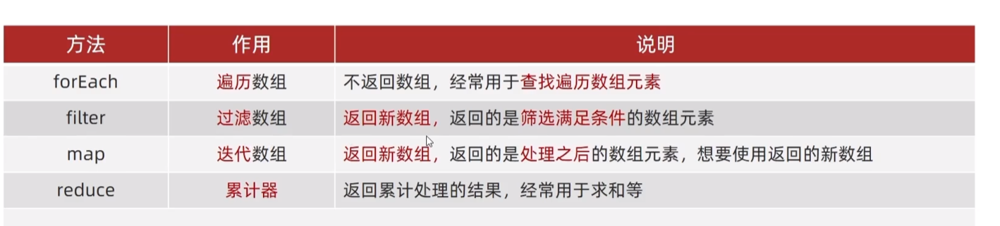

# 构造函数

## 构造函数的引入

在Java中 我们可以设计一个类，根据类中的构造函数创建一个对象。但是在JS中没有类的概念，要如何像JAVA一样创建一个对象呢？

虽然我们可以直接使用对象字面量创建对象，但是这并不具有复用性，为此JS借鉴了JAVA的构造方法：

我们可以定义一个函数作为某个对象的构造函数。通过构造函数能够帮助我们快速创建多个类似的对象

```js
function Pig(name,age){
    this.name=name
    this.age=age
}
```


## new

创建构造函数，很简单，我们只需要声明一个函数即可

```js
function fun(){
    //your code
}
```

现在该函数还是一个普通函数，但是我们使用new关键字调用它时，我们将会得到一个对象

```js
let obj =new fun()
```

JS执行new时会在构造函数中执行以下代码：

```js
function fun(){
    this={}//创建一个空对象
    //your code
    return this//返回一个对象
}
```

为此你只需要在构造函数中使用this关键字便可以创建属于你自己的对象

为了让开发者知道fun()是构造函数，常在声明构造函数时将方法的首字母**大写**。表示该方法是一个构造函数，需要使用new关键字调用

```js
function User(name,age){
    this.name=name
    this.age=age
}
const user = new User('lai',23);
```

## 类比class

JS的构造函数就相当于Java中的类，使用this添加的成员为实例成员，使用let声明的变量就当有是`private`私有变量，外界无法无法访问。但是我们可以添加getter和setter方法间接访问（闭包）

```js
function User() {
    let _age=0//私有化变量，不允许外部直接调用
    this.getAge=function () {
        return _age
    }
    this.setAge=function (age) {
        if(age>0) _age=age
    }
}
const user=new User()
user.setAge(12)
console.log(user.getAge());
```

# 内置构造函数

JS中的所有数据都可以通过内置构造函数构建，使用内置构造函数构造的类型称为包装类

## Object

```js
const pig={uname:'佩奇',age:21}
```

JS实际上运行的代码：

```js
const pig=new Object({uname:'佩奇',age:21})
```

### Object.keys

Object的静态方法，用于获取对象中的所有key

> **API**
>
> *Object.keys(Object)*
>
> *Return:Array*

```js
Object.keys(pig)
```

> [ 'uname', 'age' ]

### Object.values

Object的静态方法，用于获取对象中的所有value

> **API**
>
> *Object.values(Object)*
>
> *Return:Array*

### Object.assign

合并对象，将src对象合并至target对象。target的value将会发生变化

> **API**
>
> *Object.values(target,src)*
>
> **src**:原对象
>
> **target**:目标对象
>
> *Return:void*

```js
Object.assign(o,{uname:'lai'})
```

## Array

```js
const arr=[1,2,3]
```

JS实际上运行的代码：

```js
const arr=new Array(1,2,3)
```

### API



> **API**
>
> reduce返回累计处理的结果，
>
> return得到的结果将作为下一轮循环的pre值，
>
> current始终指向当前数组元素
>
> - 如果没有起始值，就将数组的第一个元素作为pre
> - 每一次循环，把返回值作为下一次循环的上一次值（`Return`->`pre`）
> - 如果有起始值，则起始值作为上一次值
>
> ```js
> reduce(function(pre,current){
> return pre与current的处理逻辑
> }[,起始值])
> ```

```js
arr=[1,5,8]
arr.reduce(function(pre,now){
    return pre+now
})
//14
```

```js
arr.reduce(function(pre,now){
    return pre+now
},10)
//10+1+5+8=24
```

| pre  | current | return |
| ---- | ------- | ------ |
| 1    | 5       | 6      |
| 6    | 8       | 14     |


## String

```js
const str='lai'
```

JS实际上运行的代码：

```js
const str=new String('lai')
```

> [String: 'lai']

## Number

# 构造函数问题

浪费内存，同一个函数，两个实例将占用两份空间。我们希望能够两个实例能够共有这个函数

# 对象成员

## 实例成员

通过对象访问的成员称为实例成员

实例对象相互独立

在构造方法内声明的成员都是实例成员

```js
function Pig(name,age){
    this.name=name
    this.age=age
}
```


## 静态成员

构造方法的属性和方法称为静态成员。静态成员只能通过构造函数访问

### 声明静态成员：

使用`静态方法.成员名`声明一个静态成员：

```js
function Pig(){
//实例成员
}
Pig.count=12
Pig.walk=function (){
    //walk
}
console.log(Pig.count)//12
```

### 内置静态成员

- name 对象名


